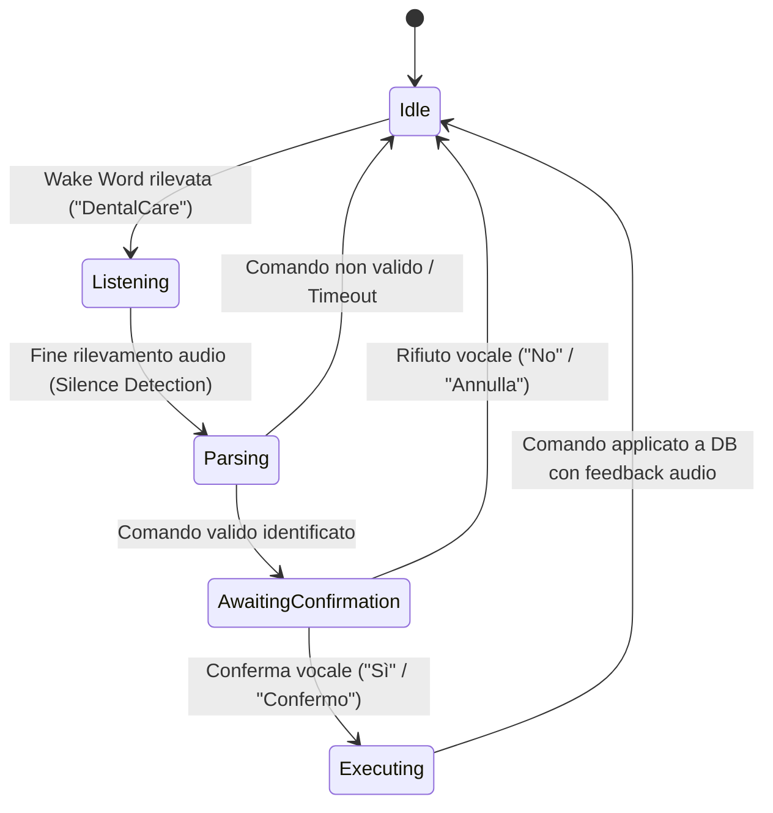

# Specifiche Tecniche e di Prodotto: Assistente Vocale "Hands-Free" da Poltrona (Chairside Agent)

**Codice Feature:** FEAT-ROADMAP-2X-CHAIRSIDE-VOICE  
**Modulo:** DentalCare Hands-Free Voice Assistant  
**Target Release:** Release 2.x / 3.x (Integrazione Clinica)  
**Stato:** Specifica di Progettazione Architetturale  
**Data:** 23 Luglio 2026  

---

## 1. Visione del Prodotto & Casi d'Uso

L'**Assistente Vocale "Hands-Free" (Chairside Agent)** consente all'odontoiatra o all'igienista dentale di interagire con la cartella clinica digitale senza dover toccare tastiera, mouse o schermo. Questo garantisce il mantenimento della massima sterilità nel campo operatorio (prevenzione delle infezioni incrociate) e velocizza la registrazione dei rilievi clinici.

### 1.1 Principali Casi d'Uso (Use Cases)
*   **Compilazione Odontogramma**: Trascrizione vocale dei rilievi dentali (es. *"Dente 16, carie occlusale"* oppure *"Dente 24, corona in ceramica"*).
*   **Sondaggio Parodontale**: Inserimento sequenziale e rapido delle misure di tasca parodontale (es. *"Dente 11: mesiale tre, vestibolare due, distale quattro"*).
*   **Dettatura Diario Clinico**: Trascrizione hands-free delle note cliniche e delle raccomandazioni post-operatorie nel diario del paziente.
*   **Interrogazione Cartella**: Richiesta vocale di dati sensibili del paziente senza interrompere l'intervento (es. *"DentalCare, mostra ultima radiografia"* o *"DentalCare, il paziente ha allergie?"*).

---

## 2. Architettura della Pipeline Vocale & Integrazione SaaS Ibrida

La piattaforma opera come una soluzione **SaaS Ibrida (Edge/Cloud)**. Il segnale vocale e l'elaborazione biometrica dell'audio rimangono rigorosamente all'interno del perimetro locale dello studio odontoiatrico, mentre la persistenza strutturata e la condivisione dello stato clinico avvengono sul cloud centralizzato del SaaS.

```
+--------------------------------------------------------------------------------+
|                        ELABORAZIONE LOCAL EDGE (CLIENT)                        |
|                                                                                |
|  [ Microfono ] ➔ [ Noise Gate / Web Audio API ] ➔ [ STT Engine (WASM/LAN) ]    |
+--------------------------------------------------------------------------------+
                                       │
                                       ▼ Solo Dati Strutturati JSON (Letti localmente)
+--------------------------------------------------------------------------------+
|                          PIATTAFORMA SAAS CENTRALIZZATA                        |
|                                                                                |
|  ➔ API Gateway ➔ Core Spring Boot Service ➔ Database Multi-Tenant PostgreSQL    |
+--------------------------------------------------------------------------------+
```

### 2.1 Distribuzione delle Operazioni (Local vs Cloud)

Per garantire la conformità alla privacy e la resilienza di rete, le operazioni sono così distribuite:

*   **Riconoscimento Vocale Client-Side (Offline)**: 
    *   L'acquisizione dell'audio avviene tramite il microfono del client.
    *   L'elaborazione e la conversione dell'audio in testo (STT) avvengono **localmente nel browser del medico** tramite compilazione **WebAssembly (WASM)** dei modelli Vosk/Whisper.cpp, oppure inviando l'audio in LAN locale a un gateway di studio (`dentalcare-ai-service`).
    *   **Nessun file audio lascia lo studio o viene inviato a server esterni.**
*   **Sincronizzazione Cloud Resiliente**:
    *   Una volta riconosciuto l'intento clinico (es. *"Dente 16 carie occlusale"*), il client genera un payload JSON leggero e lo invia al server SaaS tramite API REST crittografate.
    *   **Funzionamento Offline Temporaneo**: Se la connessione internet si interrompe, i comandi validati vengono salvati nella memoria cache locale del browser (*IndexedDB*) e trasmessi al cloud automaticamente non appena la rete torna disponibile.
*   **Sintesi Vocale Locale (TTS)**:
    *   La generazione delle risposte vocali (TTS) avviene in-process sul client tramite libreria *Voices* o *MaryTTS*, garantendo feedback istantanei senza latenza di rete (< 200ms).

---

## 3. Componenti Tecnologiche Locali (Java/Browser Integration)

### 3.1 Acquisizione e Pre-processing Audio
*   L'acquisizione dell'audio avviene tramite la classe Java `TargetDataLine` (per client desktop) o tramite le **Web Audio API** (per client browser) con campionamento a **16kHz, 16-bit Mono, PCM**.
*   **Noise Gate & Spectral Subtraction**: Filtri passa-banda software per attenuare le frequenze acustiche tipiche delle turbine odontoiatriche (frequenze comprese tra 5kHz e 8kHz) ed evitare falsi trigger.

### 3.2 Riconoscimento Vocale (Speech-to-Text) - Vosk Engine
*   **Componente**: Integrazione di **Vosk** tramite il wrapper `vosk-java` o tramite build `vosk-wasm` nel browser.
*   **Modello**: Modello italiano leggero (*Vosk Model Italian Small*).
*   **Grammatica Dinamica**: Dizionario/grammatica circoscritto alla nomenclatura odontoiatrica (es. numeri dentali da 11 a 48, termini clinici come *"carie"*, *"otturazione"*, *"protesi"*, *"mancante"*). Questo aumenta l'accuratezza del riconoscimento oltre il 98% anche in presenza di forte rumore di fondo.

### 3.3 Riconoscimento degli Intenti (Clinical Parser & DSL)
*   Il testo trascritto viene analizzato da un parser sintattico locale (senza ricorso a LLM esterni a pagamento per ridurre latenza e costi).
*   **Sintassi DSL Clinica**: Definizione di regole regex e pattern matching (es. `^dente\s+(\d{2})\s+(carie|otturazione|corona|impianto)\s+(occlusale|vestibolare|palatale|linguale|mesiale|distale)?$`).

---

## 4. Flusso di Esecuzione e Stato (State Machine)

Per evitare inserimenti accidentali dettati da conversazioni informali con il paziente, l'assistente vocale opera tramite una **Wake Word** e un sistema di conferma:



---

## 5. Bozza dello Schema Dati di Configurazione (PostgreSQL)

Ogni studio dentistico può configurare e calibrare le impostazioni della voce per-tenant:

```sql
CREATE TABLE ai_voice.chairside_agent_settings (
    tenant_id UUID PRIMARY KEY,
    is_enabled BOOLEAN DEFAULT FALSE,
    wake_word VARCHAR(50) DEFAULT 'DentalCare',
    stt_model_lang VARCHAR(10) DEFAULT 'it-IT',
    noise_suppression_level INT DEFAULT 3, -- Scala 1-5
    voice_gender VARCHAR(10) DEFAULT 'FEMALE',
    voice_speed DECIMAL(3,2) DEFAULT 1.00,
    audio_output_device VARCHAR(255) DEFAULT 'DEFAULT',
    updated_at TIMESTAMP WITH TIME ZONE DEFAULT CURRENT_TIMESTAMP
);
```

---

## 6. Compliance, Sicurezza & AI Act

*   **GDPR (Art. 32)**: L'elaborazione del segnale vocale non viene inviata a server di terze parti esterne allo studio. Le registrazioni audio temporanee in formato PCM vengono distrutte in memoria RAM immediatamente dopo la trascrizione e non vengono mai salvate su disco.
*   **EU AI Act (Trasparenza)**: All'attivazione dell'assistente vocale da parte del medico, la piattaforma emette un segnale acustico e visivo (es. icona microfono verde fissa a schermo) per informare chiunque sia presente nella stanza (incluso il paziente) che l'acquisizione audio è attiva.
*   **MDR UE 2017/745**: L'assistente vocale non effettua diagnosi autonome, agisce esclusivamente come strumento passivo di trascrizione e immissione dati dettati dall'operatore. Il perimetro regolatorio rimane classificato come software amministrativo/gestionale (non High-Risk).
