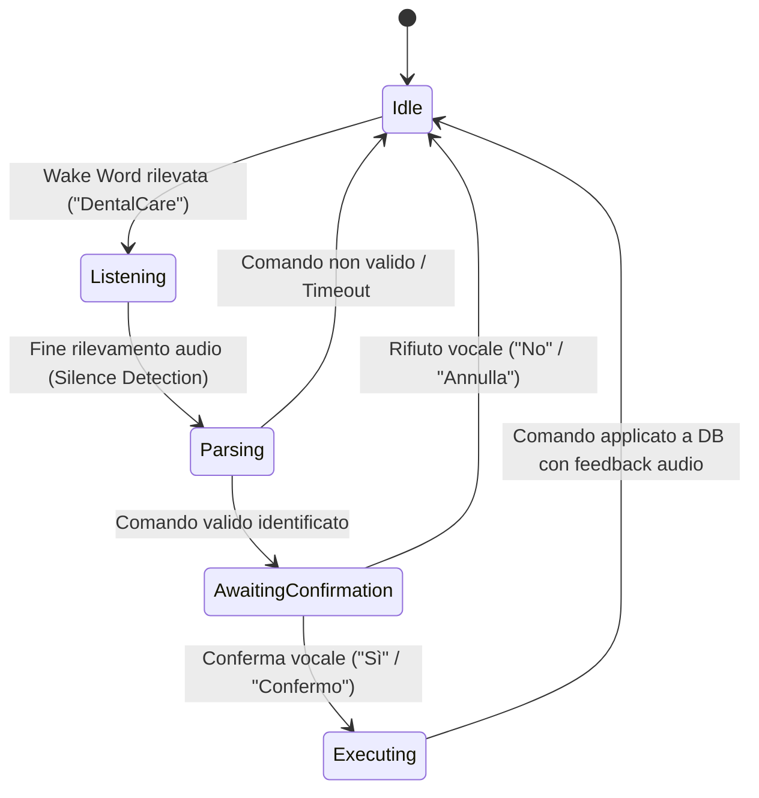

# Specifiche Tecniche e di Prodotto: Assistente Vocale "Hands-Free" da Poltrona (Chairside Agent)

**Codice Feature:** FEAT-ROADMAP-2X-CHAIRSIDE-VOICE  
**Modulo:** DentalCare Hands-Free Voice Assistant  
**Target Release:** Release 2.x / 3.x (Integrazione Clinica)  
**Stato:** Specifica di Progettazione Architetturale  
**Data:** 23 Luglio 2026  

---

## 1. Visione del Prodotto & Casi d'Uso

L'**Assistente Vocale "Hands-Free" (Chairside Agent)** consente all'odontoiatra o all'igienista dentale di interagire con la cartella clinica digitale senza dover toccare tastiera, mouse o schermo. Questo garantisce il mantenimento della massima sterilità nel campo operatorio (prevenzione delle infezioni incrociate) e velocizza la registrazione dei rilievi clinici.

### 1.1 Principali Casi d'Uso (Use Cases)
*   **Compilazione Odontogramma**: Trascrizione vocale dei rilievi dentali (es. *"Dente 16, carie occlusale"* oppure *"Dente 24, corona in ceramica"*).
*   **Sondaggio Parodontale**: Inserimento sequenziale e rapido delle misure di tasca parodontale (es. *"Dente 11: mesiale tre, vestibolare due, distale quattro"*).
*   **Dettatura Diario Clinico**: Trascrizione hands-free delle note cliniche e delle raccomandazioni post-operatorie nel diario del paziente.
*   **Interrogazione Cartella**: Richiesta vocale di dati sensibili del paziente senza interrompere l'intervento (es. *"DentalCare, mostra ultima radiografia"* o *"DentalCare, il paziente ha allergie?"*).

---

## 2. Architettura della Pipeline Vocale (100% Offline)

A tutela della riservatezza dei dati sanitari (GDPR) e per garantire la massima stabilità in assenza di connessione internet costante, l'intera pipeline vocale viene eseguita **in-process / on-premise** sul server dello studio o sul client locale.

```
+------------------+      PCM Audio Stream      +------------------------+
|  Microfono       | ─────────────────────────> | Audio Pre-processor    |
|  (Chairside)     |                            | (Noise Gate & Filters) |
+------------------+                            +------------------------+
                                                            │
                                                            ▼
+------------------+      Trascrizione (Testo)  +------------------------+
| Clinical Parser  | <───────────────────────── | Vosk STT Engine        |
| & DSL Interpreter|                            | (vosk-java / Model IT) |
+------------------+                            +------------------------+
        │
        ▼ Generazione Comando Clinico
+------------------------------------------------------------------------+
| DentalCare Core (Spring Boot Context) ➔ Esecuzione & Aggiornamento     |
+------------------------------------------------------------------------+
        │
        ▼ Output Risposta (Testo)
+------------------+      Flusso Audio (Sintesi)+------------------------+
| Altoparlante     | <───────────────────────── | Voices / MaryTTS Engine|
| (Chairside Feedback)                          | (Sintesi Vocale)       |
+------------------+                            +------------------------+
```

### 2.1 Acquisizione e Pre-processing Audio (Java Sound API)
*   L'acquisizione dell'audio avviene tramite la classe Java `TargetDataLine` con campionamento standard a **16kHz, 16-bit Mono, PCM**.
*   **Noise Gate & Spectral Subtraction**: Implementazione di un filtro software passa-banda per attenuare le frequenze acustiche tipiche del rumore dei manipoli/turbine odontoiatriche (frequenze comprese tra 5kHz e 8kHz) ed evitare falsi trigger.

### 2.2 Riconoscimento Vocale (Speech-to-Text) - Vosk Engine
*   **Componente**: Integrazione della libreria **Vosk** tramite il wrapper ufficiale `vosk-java`.
*   **Modello**: Modello italiano leggero (*Vosk Model Italian Small*) pre-installato e caricato a runtime.
*   **Grammatica Dinamica**: Configurazione del modulo di decodifica Vosk con un dizionario/grammatica ristretto per l'odontogramma (numeri dentali da 11 a 48, termini clinici come *"carie"*, *"otturazione"*, *"protesi"*, *"mancante"*). Questo aumenta l'accuratezza di riconoscimento del 98% anche in ambienti molto rumorosi.

### 2.3 Riconoscimento degli Intenti (Clinical Parser & DSL)
Il testo trascritto viene analizzato da un parser sintattico locale scritto in Java (senza ricorso a LLM esterni a pagamento per ridurre latenza e costi):
*   **Sintassi DSL Clinica**: Definizione di regole regex e pattern matching (es. `^dente\s+(\d{2})\s+(carie|otturazione|corona|impianto)\s+(occlusale|vestibolare|palatale|linguale|mesiale|distale)?$`).
*   **Fallback AI**: In caso di espressioni complesse, elaborazione locale del testo tramite *Spring AI* integrato con modelli locali di tipo BERT/distilBERT eseguiti tramite ONNX Runtime.

### 2.4 Sintesi Vocale (Text-to-Speech) - Voices Engine
*   **Componente**: Integrazione di **Voices TTS** (in-process Java wrapper per modelli locali Piper).
*   **Feedback vocale**: Risposte rapide e non invasive per confermare le azioni registrate (es. *"Dente 16 carie occlusale salvato"*).

---

## 3. Flusso di Esecuzione e Stato (State Machine)

Per evitare inserimenti accidentali dettati da conversazioni informali con il paziente, l'assistente vocale opera tramite una **Wake Word** e un sistema di conferma:



---

## 4. Bozza dello Schema Dati di Configurazione (PostgreSQL)

Ogni studio dentistico può configurare e calibrare le impostazioni della voce per-tenant:

```sql
CREATE TABLE ai_voice.chairside_agent_settings (
    tenant_id UUID PRIMARY KEY,
    is_enabled BOOLEAN DEFAULT FALSE,
    wake_word VARCHAR(50) DEFAULT 'DentalCare',
    stt_model_lang VARCHAR(10) DEFAULT 'it-IT',
    noise_suppression_level INT DEFAULT 3, -- Scala 1-5
    voice_gender VARCHAR(10) DEFAULT 'FEMALE',
    voice_speed DECIMAL(3,2) DEFAULT 1.00,
    audio_output_device VARCHAR(255) DEFAULT 'DEFAULT',
    updated_at TIMESTAMP WITH TIME ZONE DEFAULT CURRENT_TIMESTAMP
);
```

---

## 5. Compliance, Sicurezza & AI Act

*   **GDPR (Art. 32)**: L'elaborazione del segnale vocale non viene inviata a server di terze parti esterne allo studio. Le registrazioni audio temporanee in formato PCM vengono distrutte in memoria RAM immediatamente dopo la trascrizione e non vengono mai salvate su disco.
*   **EU AI Act (Trasparenza)**: All'attivazione dell'assistente vocale da parte del medico, la piattaforma emette un segnale acustico e visivo (es. icona microfono verde fissa a schermo) per informare chiunque sia presente nella stanza (incluso il paziente) che l'acquisizione audio è attiva.
*   **MDR UE 2017/745**: L'assistente vocale non effettua diagnosi autonome, agisce esclusivamente come strumento passivo di trascrizione e immissione dati dettati dall'operatore. Il perimetro regolatorio rimane classificato come software amministrativo/gestionale (non High-Risk).
