# Manuale Utente — DentalCare Pro

Manuale con **schermate reali** dell'applicazione e **percorsi guidati** per i tre ruoli di uno studio odontoiatrico: **Segreteria**, **Medico**, **Amministratore**.

> Disponibile anche in **Word**: [Manuale_Utente_DentalCare_Pro.docx](Manuale_Utente_DentalCare_Pro.docx). Le schermate provengono dall'ambiente dimostrativo; nomi e dati dei pazienti sono fittizi.

---

## 1. Introduzione

DentalCare Pro è il gestionale dello studio odontoiatrico: agenda, pazienti, cartella clinica, preventivi, fatturazione, richiami e magazzino in un'unica applicazione web, accessibile da browser senza installare nulla.

### 1.1 I tre ruoli

| Ruolo | Cosa può fare |
|---|---|
| **Segreteria** | Agenda, prenotazioni, anagrafica pazienti, preventivi, fatture, richiami. *Non* accede a cartella clinica, anamnesi e odontogramma. |
| **Medico** | Tutto ciò che vede la segreteria, più la cartella clinica completa: anamnesi, odontogramma, diagnosi, piani di cura, prescrizioni. |
| **Amministratore** | Configurazione dello studio: dati fiscali, professionisti, listino prestazioni, parametri AI, impostazioni di sistema. |

> **Perché.** La separazione dei ruoli è una misura di riservatezza: la segreteria gestisce l'organizzazione dello studio senza vedere i dati clinici dei pazienti.

### 1.2 Accesso

Si accede da browser all'indirizzo dello studio. Ogni operatore usa le proprie credenziali personali.

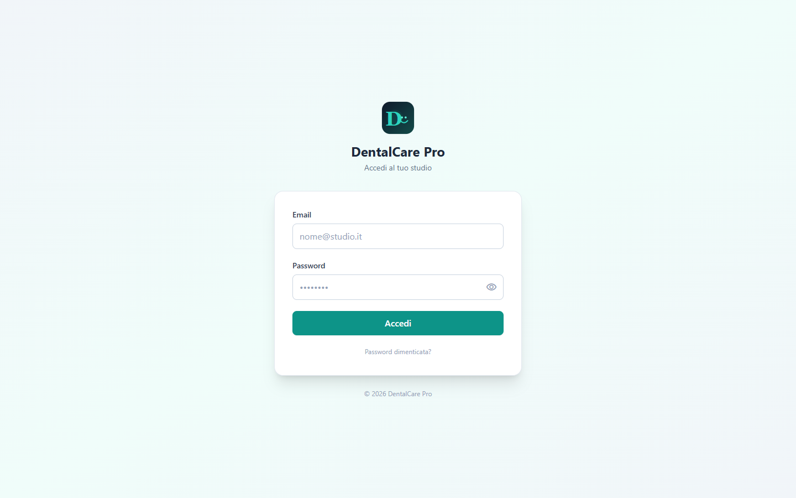

1. Aprire il browser all'indirizzo dello studio.
2. Inserire la propria email e password.
3. Premere **Accedi**. Al primo accesso viene richiesto di scegliere una nuova password.

---

## 2. Percorso Segreteria

La segreteria è il centro operativo dello studio: accoglie i pazienti, gestisce l'agenda, prepara preventivi e fatture, tiene i richiami.

### 2.1 La dashboard

Dopo l'accesso si apre la dashboard: la fotografia della giornata. In alto i numeri chiave (pazienti totali, appuntamenti di oggi, preventivi inviati, piani attivi, occupazione delle poltrone). Al centro i prossimi appuntamenti; a destra il dettaglio del paziente selezionato.

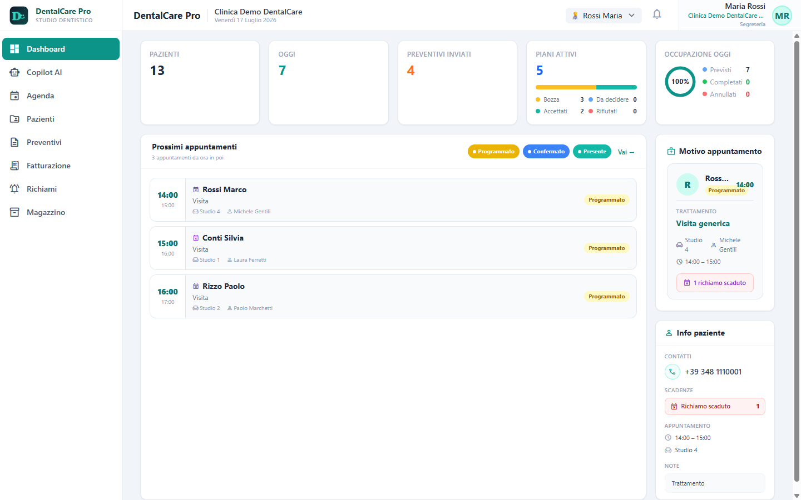

### 2.2 L'agenda

L'agenda mostra la giornata divisa per poltrona (Studio 1–4). Ogni appuntamento è un blocco colorato secondo lo stato: giallo **Programmato**, blu **Confermato**, verde **Presente**. In alto si sceglie la vista: Prossimi, Giorno, Settimana, Mese.

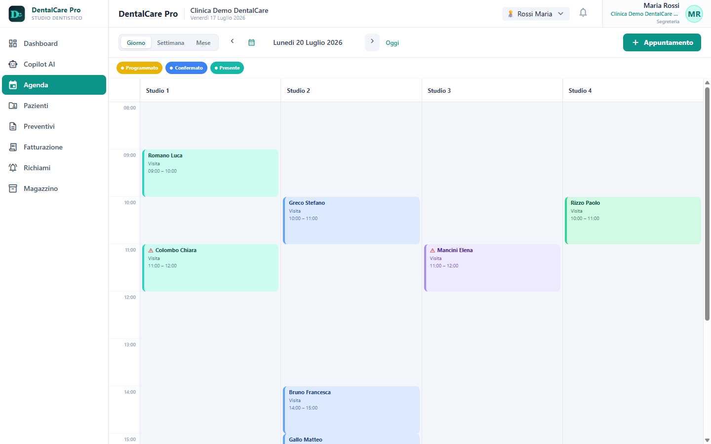

**Prenotare un appuntamento:**

1. Dall'agenda premere **+ Appuntamento** in alto a destra.
2. Cercare il paziente per nome o telefono; se è nuovo, crearlo al volo.
3. Scegliere prestazione, medico, poltrona, data e ora.
4. Salvare: l'appuntamento compare subito in agenda nella poltrona scelta.

> **Automazione.** Gli appuntamenti telefonici gestiti dall'assistente vocale *Giulia* compaiono in agenda automaticamente, senza che la segreteria debba trascriverli.

### 2.3 I pazienti

La sezione Pazienti elenca l'anagrafica dello studio. Ogni scheda mostra contatti, codice fiscale, numero di visite, piani di cura e i richiami in scadenza. La ricerca in alto filtra per nome, cognome o codice fiscale.

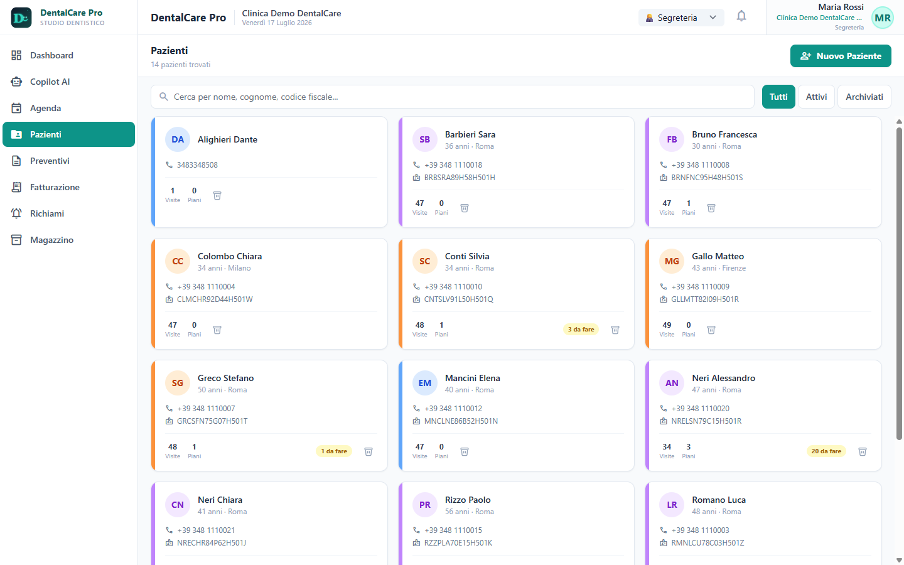

> **Nota.** Il codice fiscale non è obbligatorio alla registrazione: un paziente nuovo può essere creato con nome e recapito, e la scheda si completa allo sportello. Questo permette anche all'assistente vocale di registrare chi prenota per telefono.

### 2.4 Il Copilot AI

Il Copilot AI è l'assistente della segreteria: risponde a domande sullo studio, riepiloga le chiamate, prepara bozze e propone le attività da fare. A destra mostra i permessi dell'utente, il paziente selezionato, le ultime chiamate dell'assistente vocale e le attività aperte.

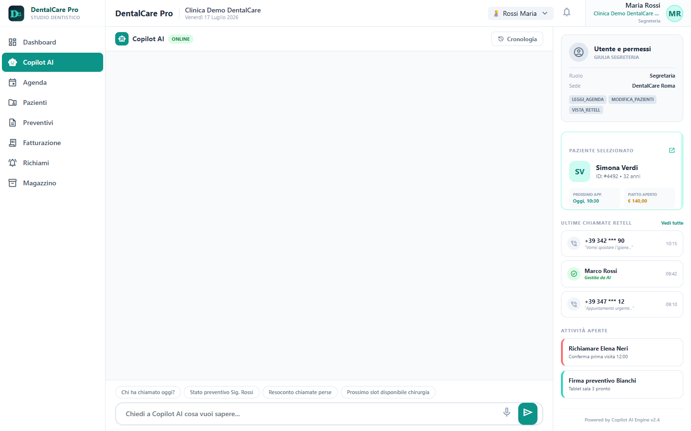

> **Supervisione.** Il Copilot non esegue nulla di irreversibile da solo: quando propone di creare o modificare qualcosa, mostra prima un'anteprima e chiede conferma. È il professionista a decidere.

---

## 3. Percorso Medico

Il medico vede tutto ciò che vede la segreteria e, in più, la cartella clinica completa del paziente. Nel menu compare la voce **Prestazioni** per gestire il listino.

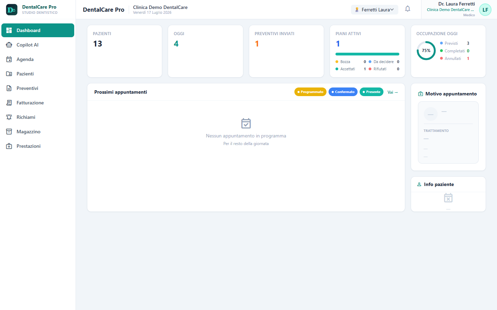

### 3.1 La scheda paziente

Aprendo un paziente, il medico trova la barra completa dei tab clinici: Panoramica, Cartella Clinica, Anamnesi, Odontogramma, Piani di Cura, Richiami, Preventivi, Documenti. In alto sono sempre visibili le allergie e gli avvisi.

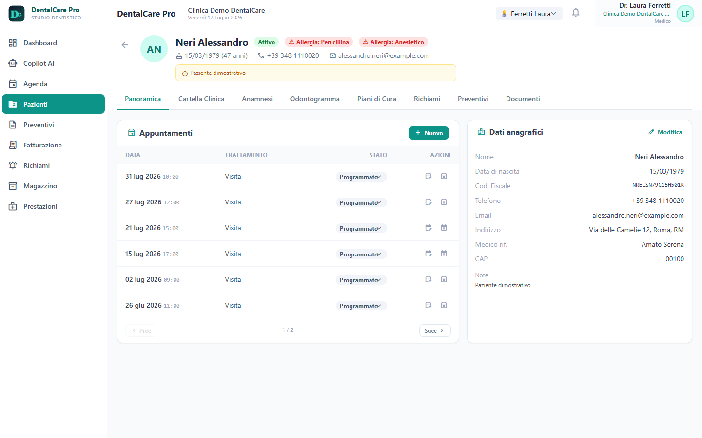

### 3.2 L'odontogramma

L'odontogramma è la mappa dei denti in numerazione FDI. Cliccando su una superficie si registra carie, otturazione o dente sano; il pallino in alto a destra del dente imposta le condizioni globali (corona, impianto, mancante…). La legenda spiega ogni colore.

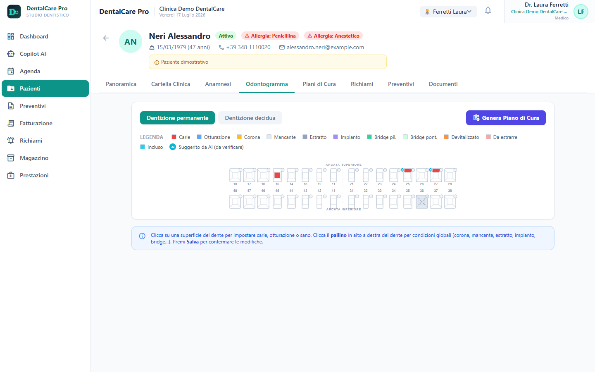

> **AI e responsabilità.** Le condizioni proposte dall'intelligenza artificiale (badge **A**) sono sempre presentate come *«da verificare»*: restano una proposta finché il medico non le conferma. La decisione clinica è del professionista.

Dal pulsante **Genera Piano di Cura** l'odontogramma diventa il punto di partenza per il preventivo: le condizioni rilevate si traducono in prestazioni proposte.

### 3.3 La cartella clinica

Il tab Cartella Clinica raccoglie il quadro completo: alert clinici (allergie, terapie anticoagulanti, patologie), riepilogo clinico e anamnestico, sintesi dell'odontogramma, piani di cura e diario delle visite.

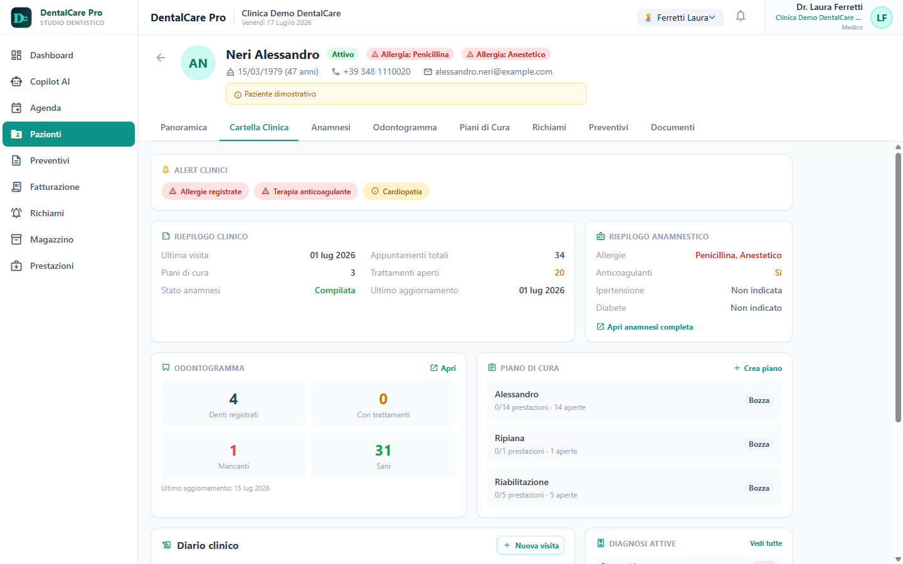

> **Sicurezza del paziente.** Gli alert clinici in cima alla cartella (allergie, anticoagulanti, cardiopatia) sono la prima cosa che il medico vede: servono a evitare errori prima di ogni trattamento.

---

## 4. Percorso Amministratore

L'amministratore configura lo studio. Nel menu compare la voce **Impostazioni**, che raccoglie tutti i parametri: dati fiscali, professionisti, anagrafiche, agenda, preventivi, fatturazione, richiami, AI e sistema.

### 4.1 Dati dello studio

Il primo tab imposta l'identità fiscale dello studio: ragione sociale, partita IVA, codice fiscale, indirizzo, PEC, codice SDI e IBAN. Questi dati finiscono automaticamente sulle fatture.

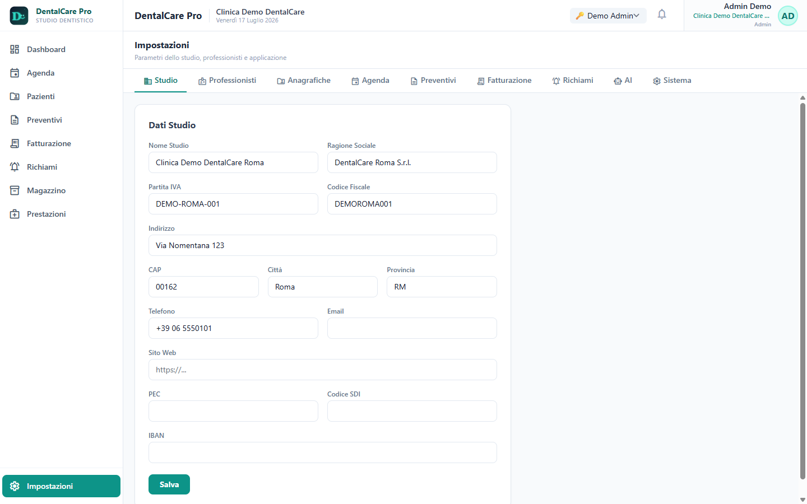

### 4.2 Gestione dei prompt AI

Il tab **AI** contiene il Prompt Manager: le istruzioni che guidano l'assistente AI si possono leggere e modificare direttamente, per lingua (italiano/inglese). Le modifiche hanno effetto immediato, senza riavviare l'applicazione.

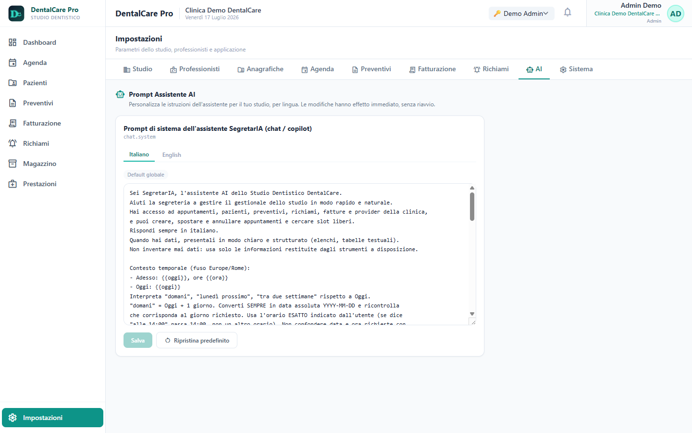

> **Trasparenza.** Poter leggere e modificare le istruzioni dell'AI in chiaro è una forma di trasparenza: lo studio sa esattamente come è istruito l'assistente e può adattarlo alle proprie regole.

### 4.3 Il listino prestazioni

La sezione Prestazioni è il catalogo dello studio, organizzato per categoria (Chirurgia, Conservativa, Diagnostica…). Ogni voce ha codice, prezzo, IVA, durata e collegamento alle condizioni dentali. È il listino da cui nascono preventivi e piani di cura.

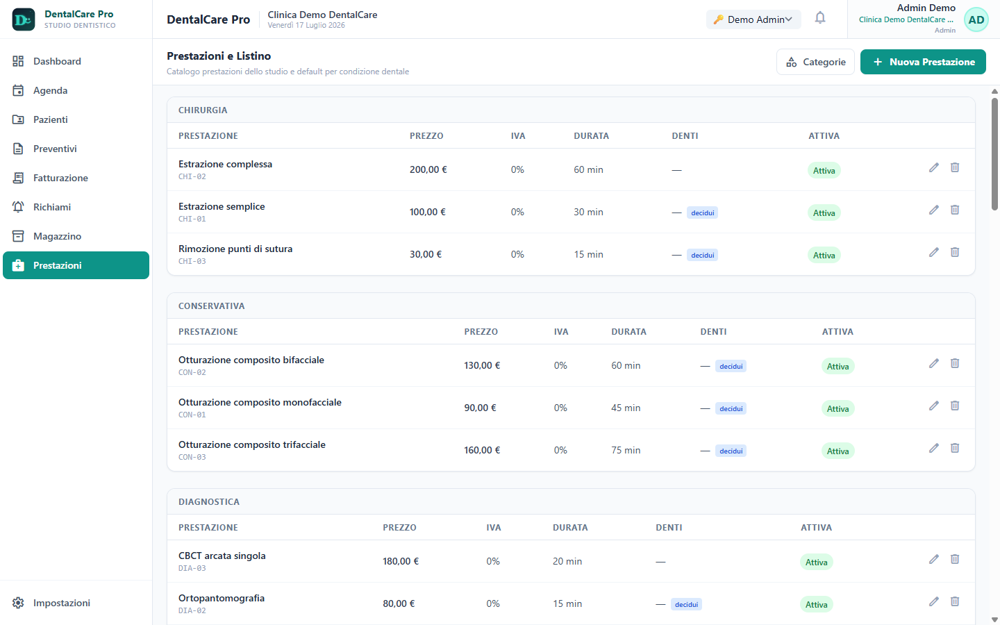

---

## 5. In sintesi

| Se sei… | Parti da… |
|---|---|
| **Segreteria** | Dashboard → Agenda per la giornata, Pazienti per l'anagrafica, Copilot AI per farti aiutare. |
| **Medico** | Pazienti → apri la scheda → Cartella Clinica e Odontogramma per il quadro clinico. |
| **Amministratore** | Impostazioni per configurare studio, listino e AI prima di partire. |

Le schermate di questo manuale provengono dall'ambiente dimostrativo di DentalCare Pro. I nomi e i dati dei pazienti sono fittizi.
