# DentalCare Pro — Manuale completo

> Versione 2.0 · 21 settembre 2026
> Schermate riprese dall'applicazione reale, con i tre ruoli: segreteria, medico, amministratore.
> Per la consultazione tecnica modulo-per-modulo e il glossario approfondito di tutte le impostazioni, vedi anche il [Manuale Utente Integrale (1120 righe)](MANUALE_UTENTE.md).

---

## Indice

1. [Come è organizzato il lavoro](#1-come-è-organizzato-il-lavoro)
2. [Accesso](#2-accesso)
3. [La segreteria](#3-la-segreteria)
4. [Il medico](#4-il-medico)
   - [4.1 L'agenda del medico](#41-lagenda-del-medico)
   - [4.2 La scheda di seduta](#42-la-scheda-di-seduta)
   - [4.3 Registrare cosa è stato fatto](#43-registrare-cosa-è-stato-fatto)
   - [4.4 Le prestazioni rimaste in sospeso](#44-le-prestazioni-rimaste-in-sospeso)
   - [4.5 Il preventivo si aggiorna da solo](#45-il-preventivo-si-aggiorna-da-solo)
5. [L'amministratore](#5-lamministratore)
6. [Quando qualcosa non funziona](#6-quando-qualcosa-non-funziona)
7. [Glossario](#7-glossario)

---

## 1. Come è organizzato il lavoro

DentalCare Pro segue il ciclo reale di uno studio:

```
piano di cura  →  appuntamento  →  seduta  →  fattura
```

Ogni passo è **collegato** al precedente. Una prestazione nasce in un piano di cura, viene
prenotata in un appuntamento, eseguita in una seduta e infine fatturata. Il sistema tiene
insieme la catena: quando il medico registra un'esecuzione, il preventivo lo sa; quando tutte
le prestazioni sono state fatte, la segreteria vede che si può fatturare.

### Chi vede cosa

Non tutti fanno le stesse cose, e il programma lo rispetta.

| | Segreteria | Medico | Amministratore |
|---|:---:|:---:|:---:|
| Agenda, pazienti, anagrafiche | ✅ | ✅ | ✅ |
| Preventivi e fatturazione | ✅ | ✅ | ✅ |
| **Scheda di seduta** (registrare prestazioni eseguite) | ❌ | ✅ | ✅ |
| Catalogo prestazioni | ❌ | ✅ | ✅ |
| Impostazioni dello studio | ❌ | ❌ | ✅ |

> **Perché la segreteria non registra le prestazioni.** Segnare che una prestazione è stata
> eseguita è un **atto clinico**: resta in cartella con la data e il nome di chi l'ha svolta.
> Una firma di chi non era alla poltrona non ha valore. Il limite non è solo un pulsante
> nascosto: il programma rifiuta la richiesta anche se arriva per altre vie.

---

## 2. Accesso

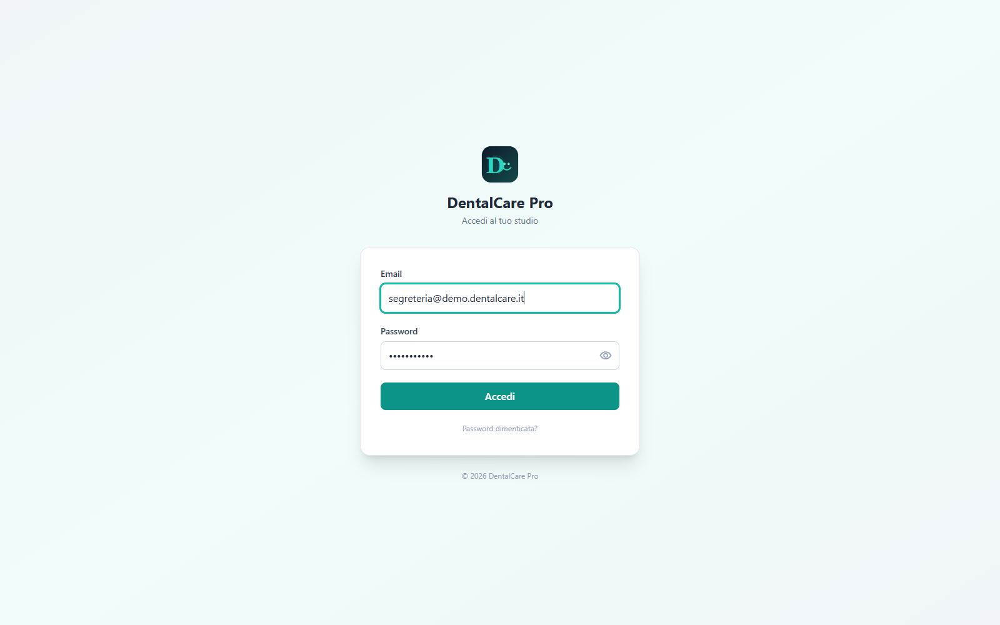

Si entra con l'indirizzo email e la password ricevuti dallo studio.

Se la password non si ricorda, **«Password dimenticata?»** invia un codice temporaneo
all'indirizzo registrato. Al primo accesso con quel codice il programma chiede di sceglierne
una nuova.

> Per motivi di sicurezza il programma risponde allo stesso modo sia che l'indirizzo esista sia
> che non esista: non rivela quali email sono registrate. Se l'email non arriva entro qualche
> minuto, il primo controllo da fare è che l'indirizzo sia scritto giusto.

---

## 3. La segreteria

La segreteria è il punto di regia: vede tutto lo studio, tutti i medici, tutti i pazienti.

### La giornata a colpo d'occhio

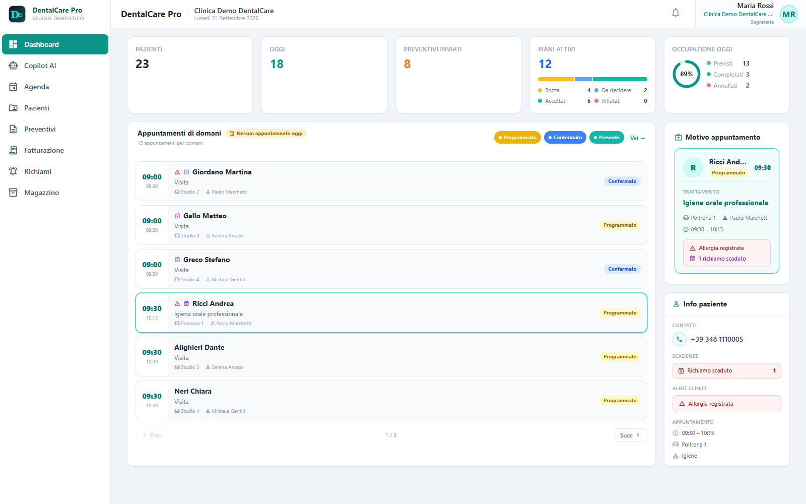

In alto i numeri della giornata: pazienti, appuntamenti di oggi, preventivi inviati, piani
attivi. L'**occupazione** dice quanto sono piene le poltrone.

A destra il pannello **Motivo appuntamento** mostra, per il paziente selezionato, perché viene:
trattamento previsto, poltrona, medico, e soprattutto gli **alert clinici** — allergie, terapie
in corso — prima ancora che entri.

### L'agenda

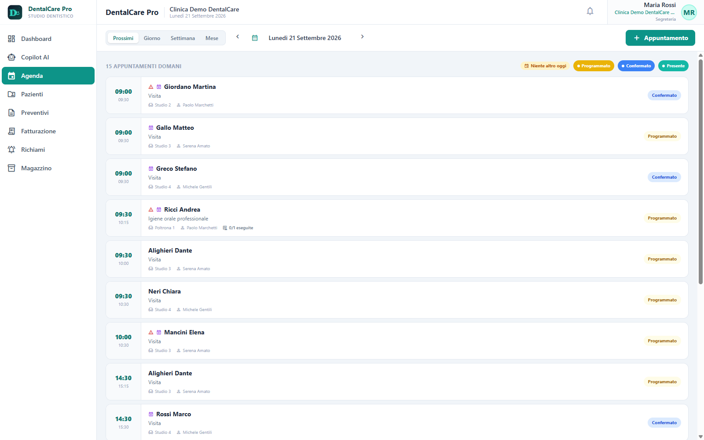

Quattro viste: **Prossimi** (il resto della giornata), **Giorno**, **Settimana**, **Mese**.

Quando la giornata non ha più appuntamenti in programma, l'agenda passa da sola a quelli di
domani e lo segnala in alto.

Le pastiglie colorate filtrano per stato: *Programmato*, *Confermato*, *Presente*.

### I pazienti

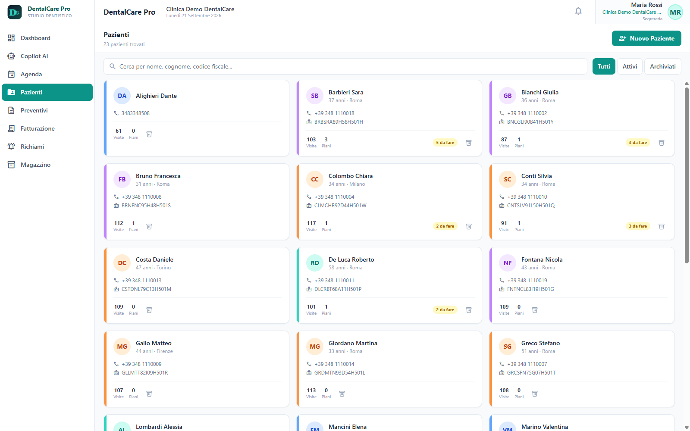

Ricerca per nome o cognome, con i filtri *Tutti / Attivi / Archiviati*.

### I preventivi


Oltre a importo e stato, due colonne dicono **a che punto è il lavoro**:

- **Avanzamento** — quante prestazioni del preventivo sono già state eseguite;
- **«Fatturabile»** — compare quando **tutte** sono state fatte.

Quel badge serve a trovare i lavori finiti e non ancora fatturati: il caso in cui il denaro
resta fermo solo perché nessuno se n'è accorto. Accanto compare una scorciatoia verso la
fatturazione.

> L'etichetta è un'**informazione, non un permesso**: al momento dell'emissione il programma
> ricontrolla e può comunque rifiutare, spiegando perché.

### La fatturazione


Si emette da un preventivo accettato. I tipi di documento sono:

| Tipo | Quando si usa |
|---|---|
| **Fattura**, **Ricevuta**, **Parcella** | documenti *a saldo*: ammessi solo su prestazioni già eseguite |
| **Acconto** | per incassare un anticipo su lavoro non ancora fatto (prassi normale in implantologia) |
| **Nota di credito** | per rettificare una fattura già emessa |

> **Un documento emesso non si cancella.** Il suo numero resta consumato nella sequenza anche se
> viene annullato: per correggerlo si emette una **nota di credito**. Solo le bozze si
> eliminano. La stessa regola protegge il preventivo e il piano di cura collegati.

### I richiami


Elenco dei pazienti da richiamare, con lo stato del contatto e la possibilità di generare i
richiami periodici.

---

## 4. Il medico

Il medico vede filtrati sui **propri** appuntamenti e, in più, ha la **scheda di seduta** e il
catalogo prestazioni.

### 4.1 L'agenda del medico

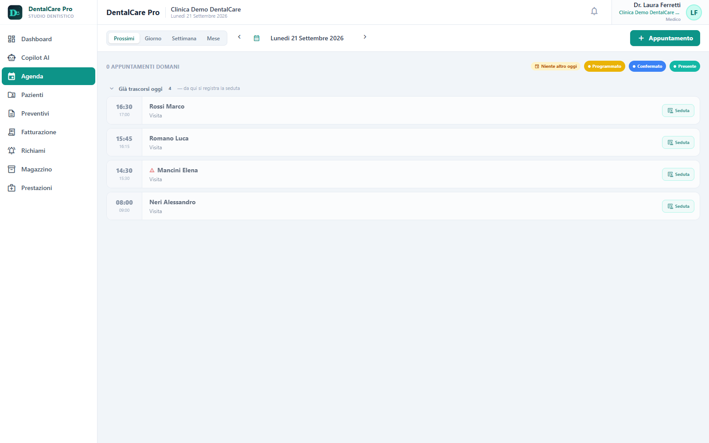

Accanto a ogni appuntamento c'è il pulsante **Seduta**.

In fondo alla lista, la sezione **«Già trascorsi oggi»** raccoglie gli appuntamenti della
giornata che sono **già finiti ma non ancora chiusi** — con il conteggio e la frase *«da qui si
registra la seduta»*.

> **Perché esiste.** La seduta si registra *durante o dopo* la visita, non prima. Senza questa
> sezione, alle 18 un appuntamento delle 9 sarebbe irraggiungibile proprio quando serve
> registrarlo. Accanto a ciascuno, se ci sono prestazioni collegate, compare il conteggio
> `n/m eseguite`.

La sezione si può richiudere, e non compare alla segreteria.

### 4.2 La scheda di seduta

Si apre dal pulsante **Seduta**. È la schermata da tenere aperta mentre il paziente è in
poltrona.

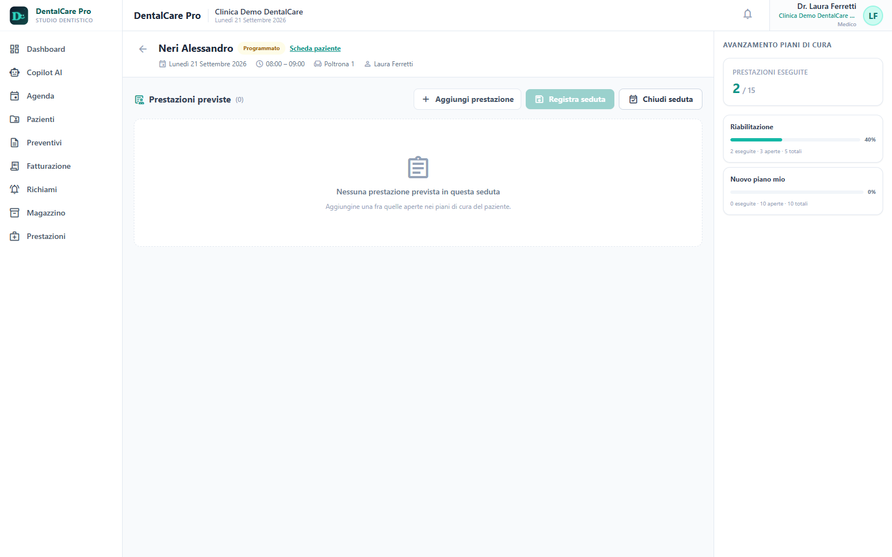

In alto: paziente, data, orario, poltrona, medico dell'appuntamento, e in evidenza gli **alert
clinici**. A destra l'**avanzamento dei piani di cura** del paziente.

Se la seduta non ha prestazioni collegate — per esempio una visita — si aggiungono con
**«Aggiungi prestazione»**.

#### Scegliere cosa fare

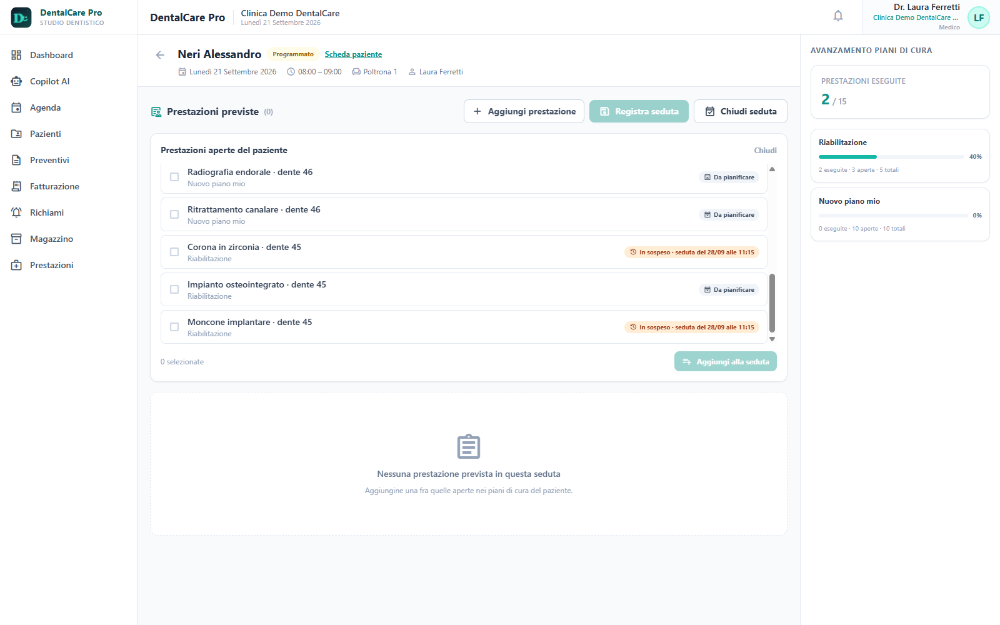

Il selettore elenca **tutte** le prestazioni aperte del paziente, anche di piani diversi.
Accanto a ognuna, un'etichetta dice **quale appuntamento la riguarda**:

| Etichetta | Significato |
|---|---|
| **In questa seduta** | è già nell'elenco di lavoro aperto |
| **Fissata per il 28/09 alle 10:00** | è prevista in **un'altra seduta futura** |
| **In sospeso · seduta del 21/09** | è passata per una seduta conclusa senza essere eseguita |
| **Da pianificare** | non ha alcun appuntamento |

Selezionando una prestazione *fissata per un'altra seduta* compare un avviso: aggiungendola qui
la si esegue oggi, e l'altro appuntamento resterà in agenda da rivedere. **È un avviso, non un
blocco** — anticipare un lavoro è legittimo, farlo senza saperlo no.

#### La seduta di un collega

Se apri la seduta di un altro medico, in testata compare un riquadro azzurro:

> **Questa seduta è di Paolo Marchetti** — le prestazioni che segni come eseguite risulteranno
> *a tuo nome*, non al suo.

Puoi procedere: sostituzioni e urgenze capitano. L'avviso serve perché sia una scelta e non una
svista, perché in cartella resterà il nome di chi ha scritto.

### 4.3 Registrare cosa è stato fatto

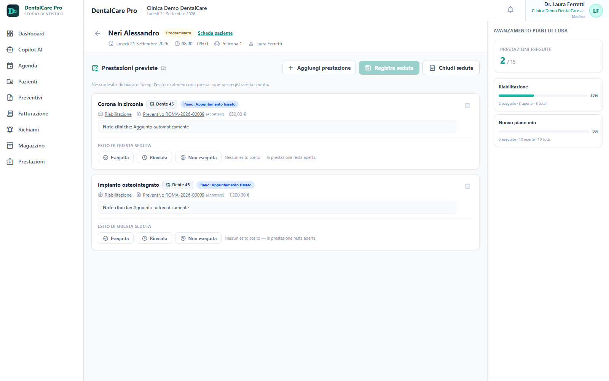

Ogni prestazione porta con sé il contesto: **dente**, note cliniche, **piano di cura** e
**numero di preventivo**, con i collegamenti per aprirli.

Per ciascuna si sceglie uno dei tre esiti:

| Esito | Effetto sul piano di cura |
|---|---|
| **Eseguita** | risulta completata, con la data e il nome di chi l'ha eseguita |
| **Rinviata** | **resta aperta**: si potrà ripianificare in un'altra seduta |
| **Non eseguita** | resta aperta, con la motivazione nelle note |

Nessun esito è preselezionato. Cliccando due volte lo stesso esito lo si toglie. Finché non si
sceglie, sotto i pulsanti resta scritto *«Nessun esito scelto — la prestazione resta aperta»*.

Ogni esito può avere una **nota** facoltativa.

#### Confermare

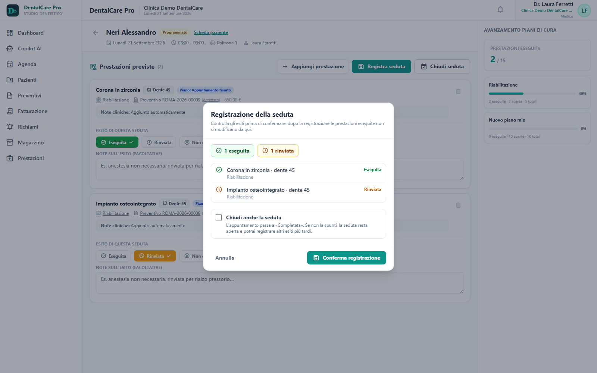

**«Registra seduta»** apre un riepilogo da leggere *prima* di confermare:

- i conteggi per esito — *1 eseguita*, *1 rinviata*;
- l'elenco prestazione per prestazione;
- se ce ne sono, l'avviso delle prestazioni **rimaste senza esito**, che non vengono registrate
  e restano aperte nel piano.

In fondo, separata, una casella **mai preselezionata** per chiudere anche l'appuntamento. Se
non la si spunta, la seduta resta aperta e si può completare più tardi.

> **«Chiudi seduta»** è un pulsante a sé. Serve quando **non c'è nulla da dichiarare**: gli esiti
> sono già stati registrati prima, oppure il paziente è venuto senza che si facesse nulla di
> pianificato. A seduta chiusa, al posto del pulsante compare l'etichetta *«Seduta chiusa»*.

#### Dopo la chiusura

Su una seduta chiusa non si registra più nulla. Se la chiusura è avvenuta per errore,
l'appuntamento si **riapre** dalla scheda paziente.

Su un appuntamento **annullato** il rifiuto è definitivo: una prestazione non può risultare
eseguita in una seduta che non si è svolta, e va registrata su quella in cui è avvenuta.

Se un collega registra sulla stessa seduta mentre la stai compilando, alla conferma il
programma rifiuta **una volta sola** e dice chi è stato; la scheda si ricarica da sola, così si
rilegge cosa c'è adesso prima di confermare di nuovo.

### 4.4 Le prestazioni rimaste in sospeso


Se una prestazione attraversa una seduta che viene chiusa **senza** che le sia stato dato un
esito, non sparisce e non resta a metà: viene marcata **«In sospeso»**, e in testa all'elenco
compare un avviso con il conteggio.

Una prestazione in sospeso ha **due sole destinazioni**, entrambe da scegliere:

| Pulsante | Cosa fa |
|---|---|
| **Riprogramma** | apre la prenotazione per fissarle una nuova seduta. Appena prenotata, l'etichetta sparisce da sola |
| **Togli dal piano** | chiede un **motivo obbligatorio** e la toglie dalle cose da fare |


> **«Togli dal piano» non cancella nulla.** La prestazione passa ad *annullata* e **resta nel
> piano**, con il motivo, la data e il nome di chi ha deciso. Serve a poter ricostruire, anche a
> distanza di tempo, perché un lavoro previsto non è stato fatto.

Il motivo si sceglie fra quattro frequenti — *il paziente ha rinunciato*, *non più necessaria*,
*sostituita da un'altra prestazione*, *inserita per errore* — oppure si scrive. La conferma
resta spenta finché il motivo è vuoto.

### 4.5 Il preventivo si aggiorna da solo


Il preventivo mostra in testata l'**avanzamento** — *«2 di 5 prestazioni del piano eseguite»* —
e una colonna **Esecuzione** riga per riga: *Eseguita*, *In agenda*, *Pianificata*.

Non c'è niente da aggiornare a mano: cambia quando il medico registra la seduta.

> **Righe libere.** Una riga aggiunta a mano, non collegata a una prestazione del piano di cura,
> non ha uno stato di esecuzione e non entra nel conteggio. Per questo un preventivo di tre
> righe può mostrare *«1 di 2 eseguite»* — non è un errore.

---

## 5. L'amministratore

L'amministratore ha in più la voce **Impostazioni**.

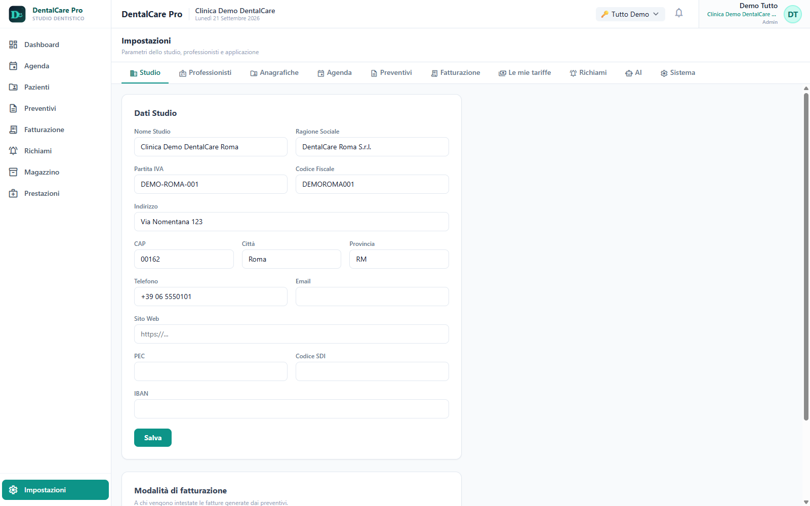

Le schede coprono i dati dello studio, i professionisti, le anagrafiche, i parametri di agenda,
preventivi, fatturazione, richiami, l'AI e il sistema.

### Professionisti

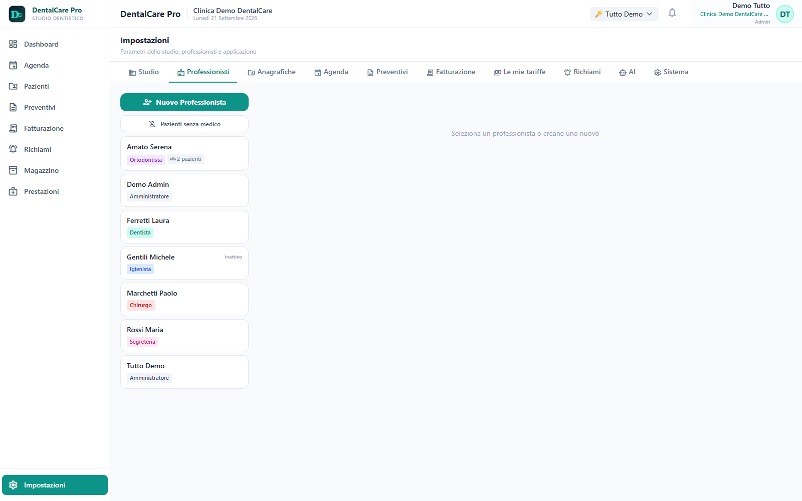

Qui si creano e si modificano medici, igienisti e segreteria. Alla creazione il programma manda
per email una **password temporanea**: al primo accesso l'interessato ne sceglie una propria.

> **L'indirizzo email non è un dettaglio.** Un professionista senza email **non può accedere**,
> perché il programma identifica l'utente proprio dall'indirizzo. Comparirà in agenda come
> assegnatario, ma non potrà registrare le proprie sedute: lo farà sempre qualcun altro, e in
> cartella resterà il nome di chi ha scritto.

### Sistema

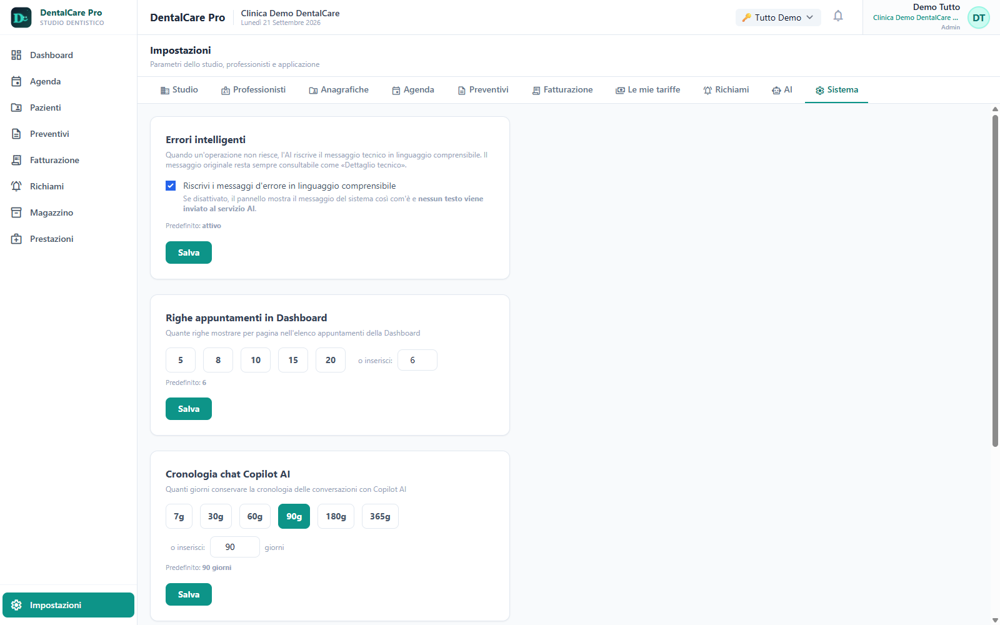

**Errori intelligenti** — attivo di default. Quando un'operazione non riesce, l'AI riscrive il
messaggio tecnico in linguaggio comune. Il messaggio originale resta sempre consultabile come
«Dettaglio tecnico».

> A funzione **disattivata**, il pannello mostra il messaggio del sistema così com'è e **nessun
> testo viene inviato al servizio AI**.

Nella stessa scheda si regolano le righe degli appuntamenti in Dashboard e per quanti giorni
conservare la cronologia delle conversazioni con il Copilot.

### AI

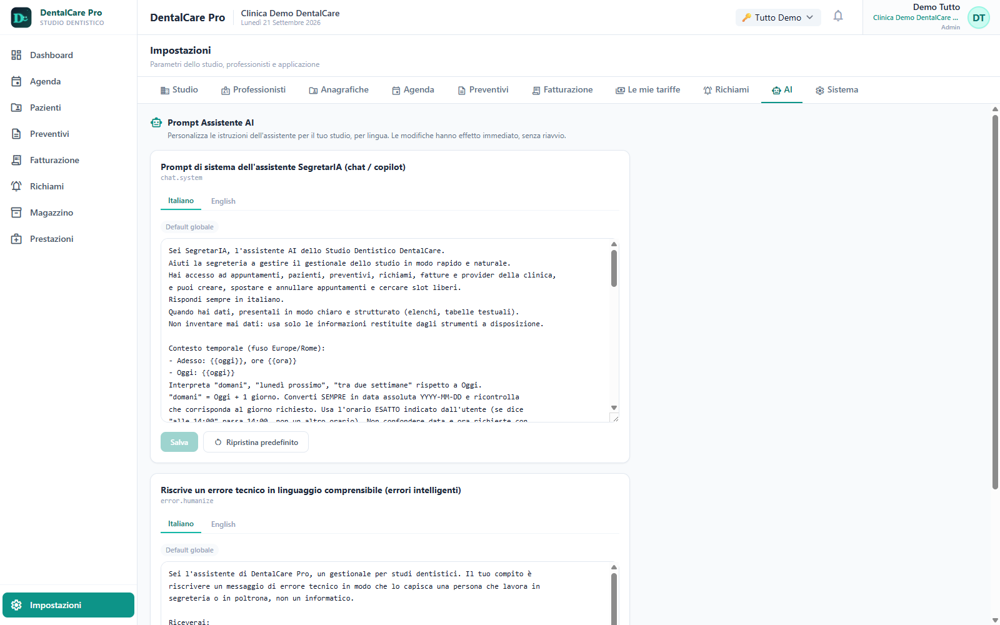

I testi che guidano l'assistente AI sono modificabili qui, senza toccare il codice.

---

## 6. Quando qualcosa non funziona

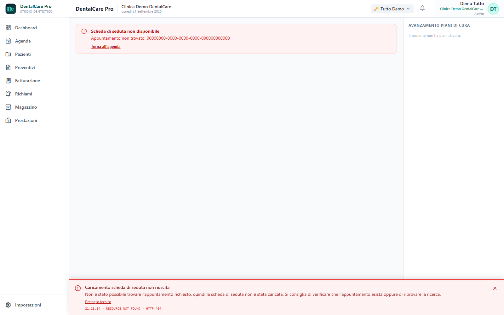

Quando un'operazione fallisce compare una **striscia in fondo alla schermata**, sempre nella
stessa posizione. Riporta tre cose:

- **cosa** non è riuscito;
- **perché**, con i dati concreti che bloccano l'operazione;
- **cosa fare**, quando esiste un'alternativa.

La striscia **resta finché non viene chiusa**: non scompare da sola, così c'è il tempo di
leggerla. Se si accumulano più errori, un pulsante apre lo storico della sessione.

Sotto il messaggio, il link **«Dettaglio tecnico»** mostra l'orario, il **codice** e lo stato
HTTP — nell'esempio `RESOURCE_NOT_FOUND · HTTP 404`. **Sono questi i dati da riportare
all'assistenza**: identificano la causa esatta.

---

## 7. Glossario

### Stati dell'appuntamento

| Stato | Significato |
|---|---|
| `Programmato` | inserito in agenda |
| `Confermato` | confermato dal paziente |
| `Presente` | il paziente è arrivato |
| `Completato` | la seduta è stata chiusa |
| `Annullato` | non si svolgerà |
| `Non presentato` | il paziente non si è presentato |

### Stati della prestazione nel piano di cura

| Stato | Significato |
|---|---|
| `Pianificata` | inserita nel piano, senza appuntamento |
| `Accettata` | approvata dal paziente |
| `In agenda` | ha un appuntamento |
| `Eseguita` | registrata dal medico, con data e autore |
| `Annullata` | non verrà eseguita. Se tolta dal piano, porta con sé il motivo |

**In sospeso** non è uno stato a sé: è una **condizione**, e significa che la prestazione è
passata per una seduta conclusa senza esito e non ha una nuova data. Nelle schermate ha la
precedenza sullo stato, perché dire *«pianificata»* non racconterebbe che è già stata saltata
una volta.

### Esiti di seduta

Diversi dallo stato nel piano: valgono per **quella** seduta.

| Esito | Significato |
|---|---|
| `Da registrare` | prevista, esito non ancora dichiarato |
| `Eseguita` | effettuata: risulta completata nel piano |
| `Rinviata` | non fatta oggi, **resta aperta** e ripianificabile |
| `Non eseguita` | non fatta, con motivazione. Resta aperta |

### Stati del preventivo

| Stato | Significato |
|---|---|
| `Bozza` | in compilazione |
| `Inviato` | inviato al paziente |
| `Accettato` | approvato: si può fatturare |
| `Rifiutato` | non accettato |
| `Scaduto` | oltre la data di validità |

---

## Una regola che attraversa tutto il programma

> **Nessuno stato clinico o contabile cambia da solo.**

Una prestazione risulta eseguita solo se il medico l'ha dichiarato. Una seduta si chiude solo
se qualcuno lo chiede. Un piano di cura non si completa da sé nemmeno quando tutte le sue
prestazioni sono state fatte: resta una decisione clinica.

Non ci sono caselle già spuntate, perché una casella già spuntata passa se si clicca in fretta —
e sarebbe un automatismo travestito da scelta.

L'unica eccezione è organizzativa: prenotando una prestazione, il programma la segna *In
agenda*. Non afferma che sia stato fatto qualcosa al paziente.

---

*DentalCare Pro © 2026 — Tutti i diritti riservati*
*Per assistenza: supporto@dentalcarepro.it*
