# Manuale Utente — DentalCare Pro

Manuale con **schermate reali** dell'applicazione e **percorsi guidati** per i tre ruoli di uno studio odontoiatrico: **Segreteria**, **Medico**, **Amministratore**.

> Disponibile anche in **Word**: [Manuale_Utente_DentalCare_Pro.docx](Manuale_Utente_DentalCare_Pro.docx). Per la trattazione completa e approfondita di tutti i moduli, schermate, ciclo della seduta e glossario degli stati, consulta il **[Manuale Utente Integrale (1120 righe)](MANUALE_UTENTE.md)**. Le schermate provengono dall'ambiente dimostrativo; nomi e dati dei pazienti sono fittizi.

---

## 1. Introduzione

DentalCare Pro è il gestionale dello studio odontoiatrico: agenda, pazienti, cartella clinica, preventivi, fatturazione, richiami e magazzino in un'unica applicazione web, accessibile da browser senza installare nulla.

### 1.1 I tre ruoli

| Ruolo | Cosa può fare |
|---|---|
| **Segreteria** | Agenda, prenotazioni, anagrafica pazienti, preventivi, fatture, richiami. *Non* accede a cartella clinica, anamnesi e odontogramma. |
| **Medico** | Tutto ciò che vede la segreteria, più la cartella clinica completa: anamnesi, odontogramma, diagnosi, piani di cura, prescrizioni. |
| **Amministratore** | Configurazione dello studio: dati fiscali, professionisti, listino prestazioni, parametri AI, impostazioni di sistema. |

> **Perché.** La separazione dei ruoli è una misura di riservatezza: la segreteria gestisce l'organizzazione dello studio senza vedere i dati clinici dei pazienti.

### 1.2 Accesso

Si accede da browser all'indirizzo dello studio. Ogni operatore usa le proprie credenziali personali.

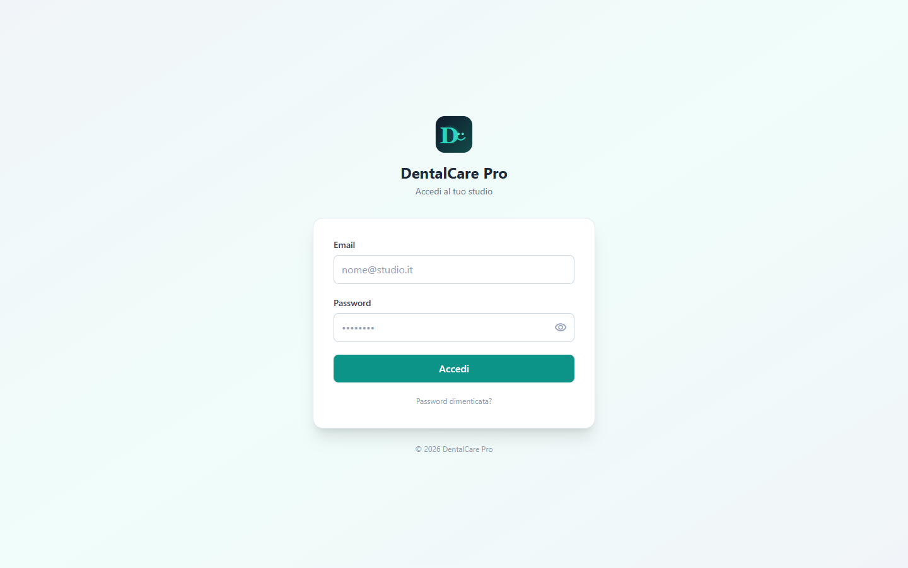

1. Aprire il browser all'indirizzo dello studio.
2. Inserire la propria email e password.
3. Premere **Accedi**. Al primo accesso viene richiesto di scegliere una nuova password.

---

## 2. Percorso Segreteria

La segreteria è il centro operativo dello studio: accoglie i pazienti, gestisce l'agenda, prepara preventivi e fatture, tiene i richiami.

### 2.1 La dashboard

Dopo l'accesso si apre la dashboard: la fotografia della giornata. In alto i numeri chiave (pazienti totali, appuntamenti di oggi, preventivi inviati, piani attivi, occupazione delle poltrone). Al centro i prossimi appuntamenti; a destra il dettaglio del paziente selezionato.

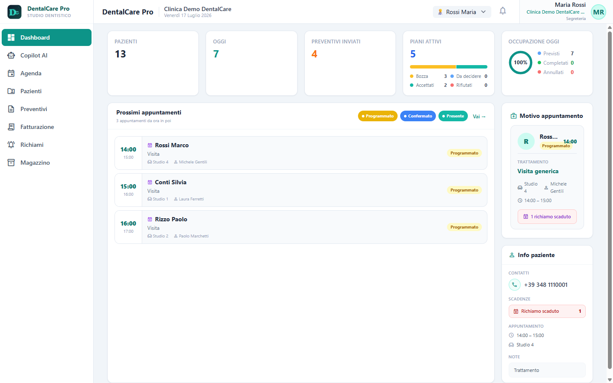

### 2.2 L'agenda

L'agenda mostra la giornata divisa per poltrona (Studio 1–4). Ogni appuntamento è un blocco colorato secondo lo stato: giallo **Programmato**, blu **Confermato**, verde **Presente**. In alto si sceglie la vista: Prossimi, Giorno, Settimana, Mese.

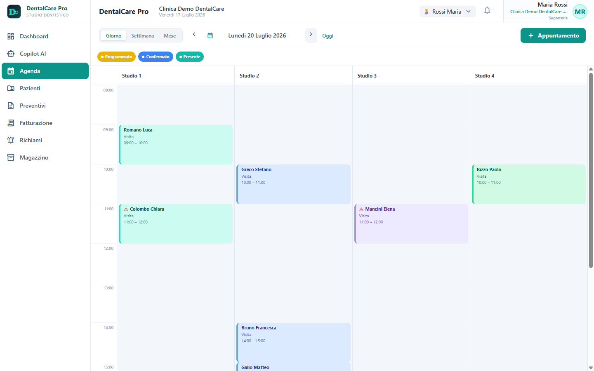

**Prenotare un appuntamento:**

1. Dall'agenda premere **+ Appuntamento** in alto a destra.
2. Cercare il paziente per nome o telefono; se è nuovo, crearlo al volo.
3. Scegliere prestazione, medico, poltrona, data e ora.
4. Salvare: l'appuntamento compare subito in agenda nella poltrona scelta.

> **Automazione.** Gli appuntamenti telefonici gestiti dall'assistente vocale *Giulia* compaiono in agenda automaticamente, senza che la segreteria debba trascriverli.

### 2.3 I pazienti

La sezione Pazienti elenca l'anagrafica dello studio. Ogni scheda mostra contatti, codice fiscale, numero di visite, piani di cura e i richiami in scadenza. La ricerca in alto filtra per nome, cognome o codice fiscale.

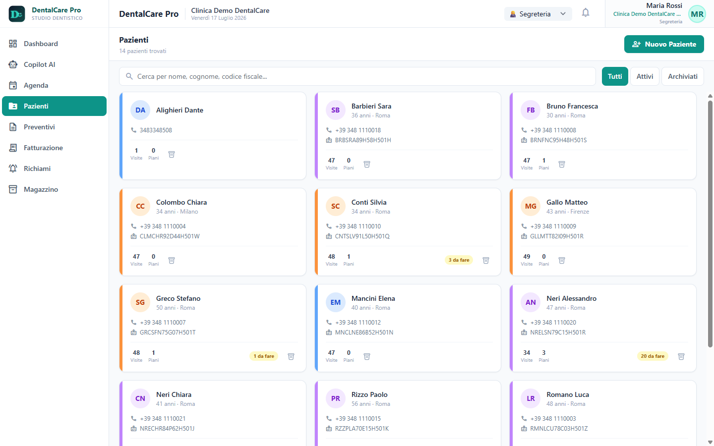

> **Nota.** Il codice fiscale non è obbligatorio alla registrazione: un paziente nuovo può essere creato con nome e recapito, e la scheda si completa allo sportello. Questo permette anche all'assistente vocale di registrare chi prenota per telefono.

### 2.4 Il Copilot AI

Il Copilot AI è l'assistente della segreteria: risponde a domande sullo studio, riepiloga le chiamate, prepara bozze e propone le attività da fare. A destra mostra i permessi dell'utente, il paziente selezionato, le ultime chiamate dell'assistente vocale e le attività aperte.

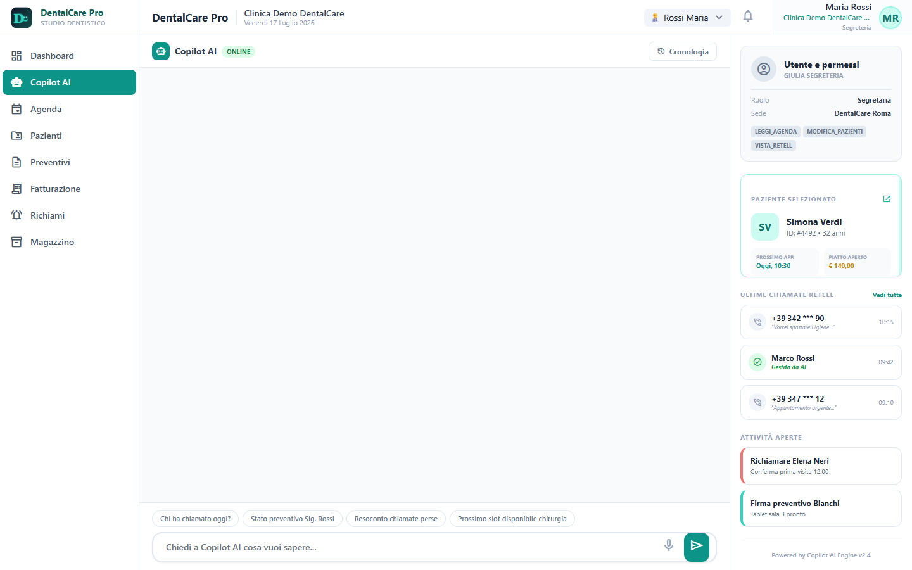

> **Supervisione.** Il Copilot non esegue nulla di irreversibile da solo: quando propone di creare o modificare qualcosa, mostra prima un'anteprima e chiede conferma. È il professionista a decidere.

### 2.5 I preventivi: a che punto è il lavoro

Oltre a importo e stato, due colonne dicono **quanto lavoro è già stato fatto**.

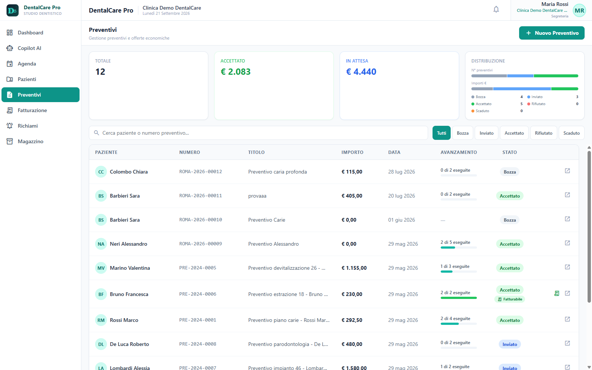

- **Avanzamento** — quante prestazioni del preventivo risultano eseguite.
- **«Fatturabile»** — compare quando **tutte** sono state fatte.

Quel badge serve a trovare i lavori finiti e non ancora fatturati: il caso in cui il denaro resta fermo solo perché nessuno se n'è accorto.

> **È un'informazione, non un permesso.** Al momento dell'emissione il programma ricontrolla e può comunque rifiutare, spiegando quali prestazioni mancano. L'etichetta indirizza l'attenzione, non autorizza nulla.

L'avanzamento non si aggiorna a mano: cambia quando il medico registra la seduta.

### 2.6 La fatturazione

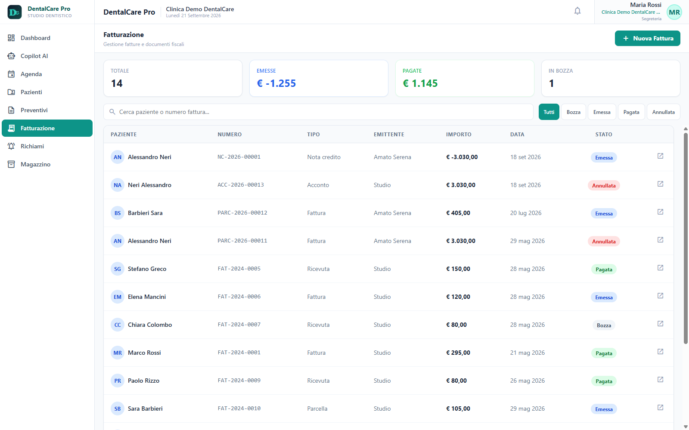

Si emette da un preventivo accettato.

| Tipo di documento | Quando si usa |
|---|---|
| **Fattura**, **Ricevuta**, **Parcella** | documenti *a saldo*: ammessi solo su prestazioni **già eseguite** |
| **Acconto** | per incassare un anticipo su lavoro non ancora fatto (prassi normale in implantologia) |
| **Nota di credito** | per rettificare una fattura già emessa |

> **Un documento emesso non si cancella.** Il suo numero resta consumato nella sequenza anche se viene annullato: per correggerlo si emette una **nota di credito**. Solo le bozze si eliminano. La stessa regola protegge il preventivo e il piano di cura collegati, che non sono eliminabili finché esiste un documento fiscale che li richiama.

### 2.7 I richiami

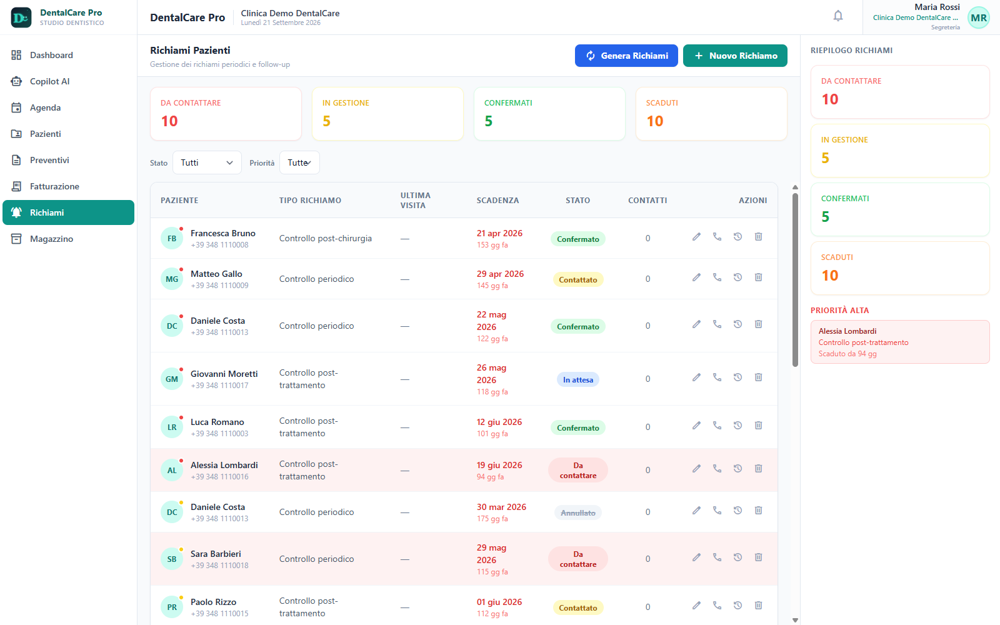

Elenco dei pazienti da richiamare con lo stato del contatto, e generazione dei richiami periodici.

---

## 3. Percorso Medico

Il medico vede tutto ciò che vede la segreteria e, in più, la cartella clinica completa del paziente. Nel menu compare la voce **Prestazioni** per gestire il listino.

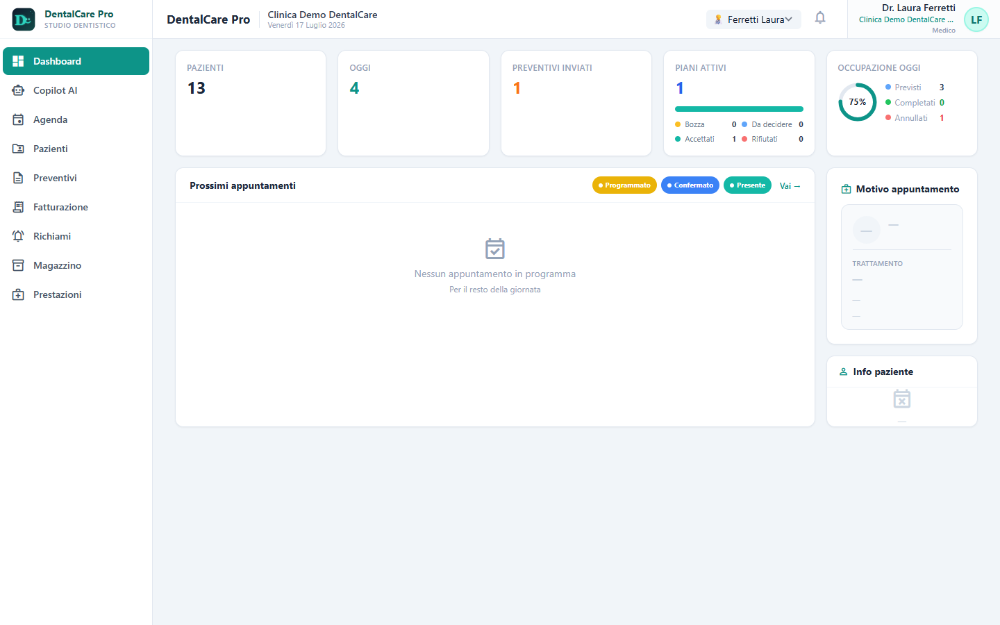

### 3.1 La scheda paziente

Aprendo un paziente, il medico trova la barra completa dei tab clinici: Panoramica, Cartella Clinica, Anamnesi, Odontogramma, Piani di Cura, Richiami, Preventivi, Documenti. In alto sono sempre visibili le allergie e gli avvisi.

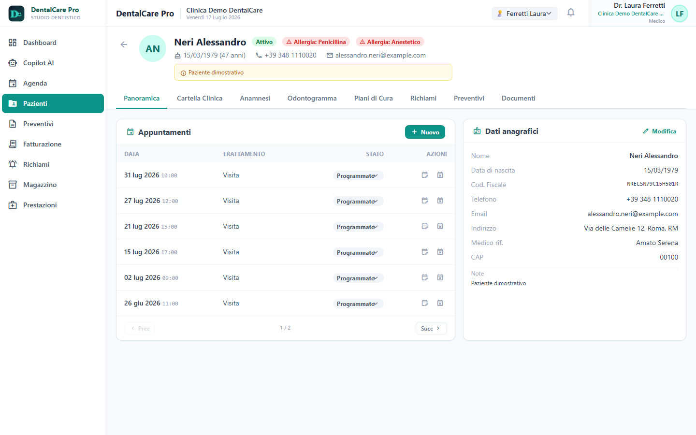

### 3.2 L'odontogramma

L'odontogramma è la mappa dei denti in numerazione FDI. Cliccando su una superficie si registra carie, otturazione o dente sano; il pallino in alto a destra del dente imposta le condizioni globali (corona, impianto, mancante…). La legenda spiega ogni colore.

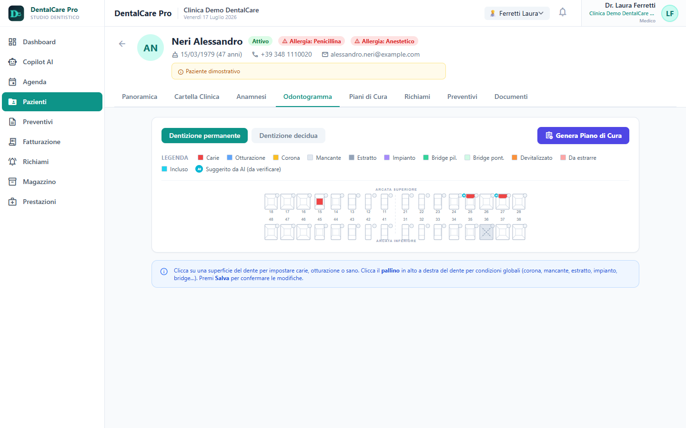

> **AI e responsabilità.** Le condizioni proposte dall'intelligenza artificiale (badge **A**) sono sempre presentate come *«da verificare»*: restano una proposta finché il medico non le conferma. La decisione clinica è del professionista.

Dal pulsante **Genera Piano di Cura** l'odontogramma diventa il punto di partenza per il preventivo: le condizioni rilevate si traducono in prestazioni proposte.

### 3.3 La cartella clinica

Il tab Cartella Clinica raccoglie il quadro completo: alert clinici (allergie, terapie anticoagulanti, patologie), riepilogo clinico e anamnestico, sintesi dell'odontogramma, piani di cura e diario delle visite.

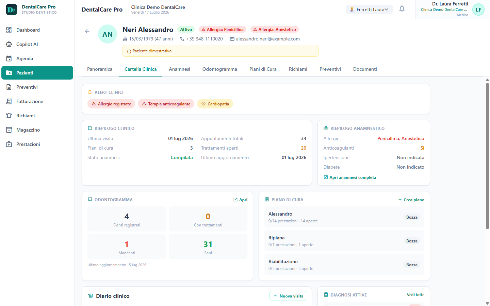

> **Sicurezza del paziente.** Gli alert clinici in cima alla cartella (allergie, anticoagulanti, cardiopatia) sono la prima cosa che il medico vede: servono a evitare errori prima di ogni trattamento.

### 3.4 L'agenda del medico

L'agenda è filtrata sui **propri** appuntamenti. Accanto a ciascuno compare il pulsante **Seduta**.

In fondo alla lista, la sezione **«Già trascorsi oggi»** raccoglie gli appuntamenti della giornata **già finiti ma non ancora chiusi**, con il conteggio e la frase *«da qui si registra la seduta»*.

> **Perché esiste.** La seduta si registra *durante o dopo* la visita, non prima. Senza questa sezione, a fine giornata un appuntamento del mattino sarebbe irraggiungibile proprio quando serve registrarlo. Dove ci sono prestazioni collegate compare anche il conteggio `n/m eseguite`.

La sezione non compare alla segreteria.

### 3.5 La scheda di seduta

È la schermata da tenere aperta mentre il paziente è in poltrona.

In alto: paziente, orario, poltrona, medico dell'appuntamento e, in evidenza sopra ogni azione, gli **alert clinici**. A destra l'avanzamento dei piani di cura del paziente.

#### Scegliere cosa fare

Il selettore elenca **tutte** le prestazioni aperte del paziente, anche di piani diversi. Accanto a ognuna un'etichetta dice **quale appuntamento la riguarda**:

| Etichetta | Significato |
|---|---|
| **In questa seduta** | è già nell'elenco di lavoro aperto |
| **Fissata per il 28/09 alle 10:00** | è prevista in **un'altra seduta futura** |
| **In sospeso · seduta del 21/09** | è passata per una seduta conclusa senza essere eseguita |
| **Da pianificare** | non ha alcun appuntamento |

Selezionando una prestazione *fissata per un'altra seduta* compare un avviso: aggiungendola qui la si esegue oggi, e l'altro appuntamento resterà in agenda da rivedere. **È un avviso, non un blocco** — anticipare un lavoro è legittimo, farlo senza saperlo no.

> **La seduta di un collega.** Aprendo la seduta di un altro medico compare un riquadro: *«Questa seduta è di Paolo Marchetti — le prestazioni che segni come eseguite risulteranno a tuo nome, non al suo»*. Si può procedere: sostituzioni e urgenze capitano. L'avviso serve perché sia una scelta e non una svista, dato che in cartella resta il nome di chi ha scritto.

#### Registrare gli esiti

Ogni prestazione porta con sé il contesto: **dente**, note cliniche, **piano di cura** e **numero di preventivo**, con i collegamenti per aprirli. Per ciascuna si sceglie uno dei tre esiti:

| Esito | Effetto sul piano di cura |
|---|---|
| **Eseguita** | risulta completata, con la data e il nome di chi l'ha eseguita |
| **Rinviata** | **resta aperta**: si potrà ripianificare in un'altra seduta |
| **Non eseguita** | resta aperta, con la motivazione nelle note |

Nessun esito è preselezionato; cliccando due volte lo stesso esito lo si toglie. Finché non si sceglie, resta scritto *«Nessun esito scelto — la prestazione resta aperta»*.

#### Confermare

**«Registra seduta»** apre un riepilogo da leggere *prima* di confermare: i conteggi per esito, l'elenco voce per voce e — se ce ne sono — l'avviso delle prestazioni **rimaste senza esito**, che non vengono registrate e restano aperte nel piano.

In fondo, separata, una casella **mai preselezionata** per chiudere anche l'appuntamento.

> **«Chiudi seduta»** è un pulsante a sé: serve quando non c'è nulla da dichiarare — gli esiti sono già stati registrati prima, oppure il paziente è venuto senza che si facesse nulla di pianificato.

Su una seduta già chiusa non si registra più nulla: se la chiusura è avvenuta per errore, l'appuntamento si **riapre** dalla scheda paziente. Su un appuntamento **annullato** il rifiuto è definitivo — una prestazione non può risultare eseguita in una seduta che non si è svolta.

Se un collega registra sulla stessa seduta mentre la stai compilando, alla conferma il programma rifiuta **una volta sola**, dice chi è stato e ricarica la scheda, così si rilegge prima di confermare di nuovo.

### 3.6 Le prestazioni rimaste in sospeso

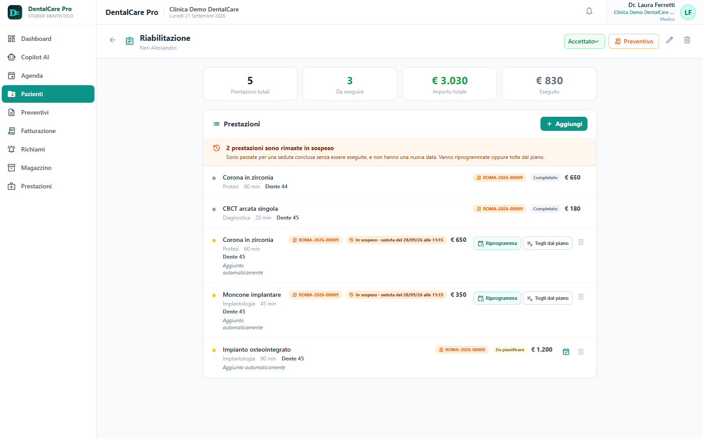

Se una prestazione attraversa una seduta chiusa **senza** che le sia stato dato un esito, non sparisce e non resta a metà: viene marcata **«In sospeso»**, e in testa all'elenco compare un avviso con il conteggio.

Ha **due sole destinazioni**, entrambe da scegliere:

| Pulsante | Cosa fa |
|---|---|
| **Riprogramma** | apre la prenotazione per una nuova seduta. Appena prenotata, l'etichetta sparisce da sola |
| **Togli dal piano** | chiede un **motivo obbligatorio** e la toglie dalle cose da fare |

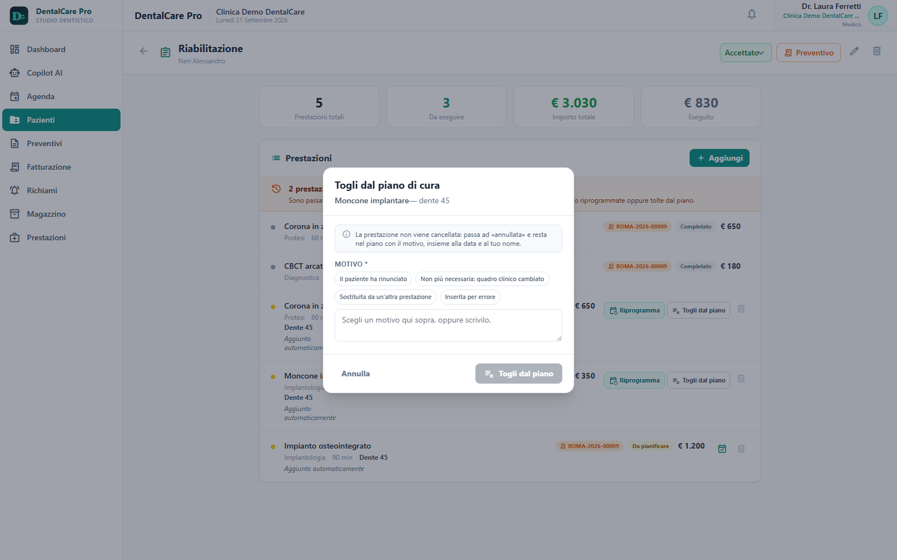

> **«Togli dal piano» non cancella nulla.** La prestazione passa ad *annullata* e **resta nel piano**, con il motivo, la data e il nome di chi ha deciso. Serve a poter ricostruire, anche a distanza di tempo, perché un lavoro previsto non è stato fatto.

### 3.7 Il preventivo si aggiorna da solo

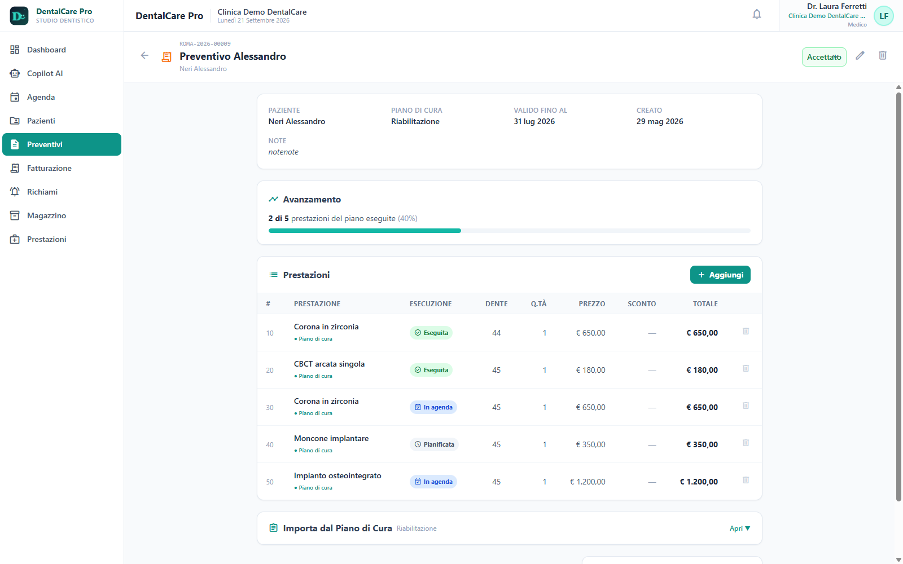

Il preventivo mostra in testata l'avanzamento — *«2 di 5 prestazioni del piano eseguite»* — e una colonna **Esecuzione** riga per riga. Non c'è niente da aggiornare a mano.

> **Righe libere.** Una riga aggiunta a mano, non collegata a una prestazione del piano, non ha uno stato di esecuzione e non entra nel conteggio. Per questo un preventivo di tre righe può mostrare *«1 di 2 eseguite»*: non è un errore.

---

## 4. Percorso Amministratore

L'amministratore configura lo studio. Nel menu compare la voce **Impostazioni**, che raccoglie tutti i parametri: dati fiscali, professionisti, anagrafiche, agenda, preventivi, fatturazione, richiami, AI e sistema.

### 4.1 Dati dello studio

Il primo tab imposta l'identità fiscale dello studio: ragione sociale, partita IVA, codice fiscale, indirizzo, PEC, codice SDI e IBAN. Questi dati finiscono automaticamente sulle fatture.

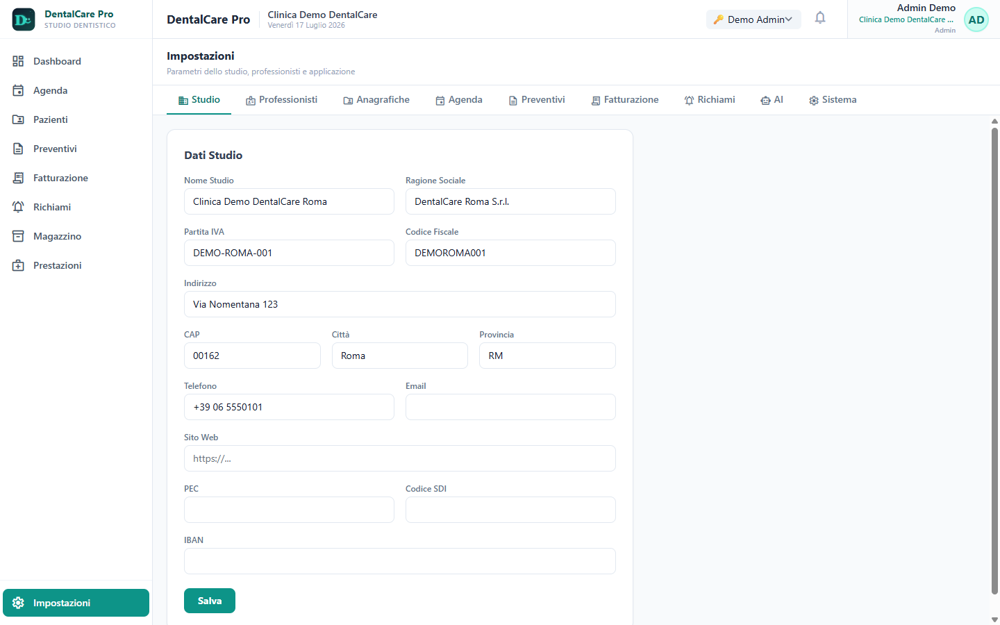

### 4.2 Gestione dei prompt AI

Il tab **AI** contiene il Prompt Manager: le istruzioni che guidano l'assistente AI si possono leggere e modificare direttamente, per lingua (italiano/inglese). Le modifiche hanno effetto immediato, senza riavviare l'applicazione.

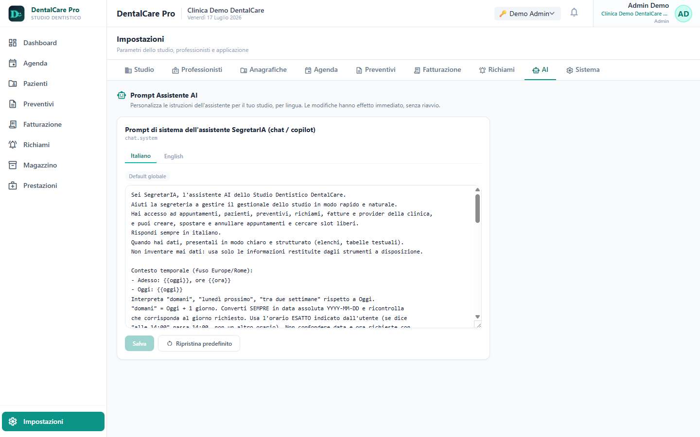

> **Trasparenza.** Poter leggere e modificare le istruzioni dell'AI in chiaro è una forma di trasparenza: lo studio sa esattamente come è istruito l'assistente e può adattarlo alle proprie regole.

### 4.3 Il listino prestazioni

La sezione Prestazioni è il catalogo dello studio, organizzato per categoria (Chirurgia, Conservativa, Diagnostica…). Ogni voce ha codice, prezzo, IVA, durata e collegamento alle condizioni dentali. È il listino da cui nascono preventivi e piani di cura.

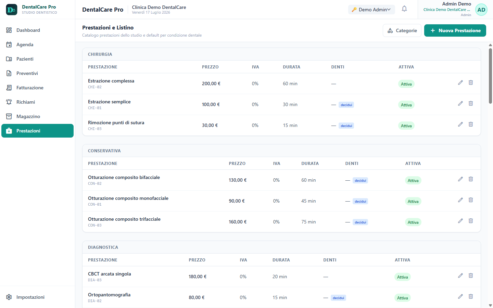

---

## 5. In sintesi

| Se sei… | Parti da… |
|---|---|
| **Segreteria** | Dashboard → Agenda per la giornata, Pazienti per l'anagrafica, Copilot AI per farti aiutare. |
| **Medico** | Pazienti → apri la scheda → Cartella Clinica e Odontogramma per il quadro clinico. Agenda → **Seduta** per registrare cosa hai fatto. |
| **Amministratore** | Impostazioni per configurare studio, listino e AI prima di partire. |

---

## 6. Quando qualcosa non funziona

Quando un'operazione fallisce compare una **striscia in fondo alla schermata**, sempre nella stessa posizione. Riporta tre cose: **cosa** non è riuscito, **perché** — con i dati concreti che bloccano l'operazione — e **cosa fare**, quando esiste un'alternativa.

La striscia **resta finché non viene chiusa**: non scompare da sola, così c'è il tempo di leggerla. Se si accumulano più errori, un pulsante apre lo storico della sessione.

Sotto il messaggio, il link **«Dettaglio tecnico»** mostra l'orario, il **codice** e lo stato HTTP. **Sono questi i dati da riportare all'assistenza**: identificano la causa esatta.

> **Errori intelligenti.** Di norma il messaggio viene riscritto dall'AI in linguaggio comune, per renderlo comprensibile anche a chi non ha dimestichezza con i messaggi di sistema. L'originale resta sempre sotto «Dettaglio tecnico». La funzione si disattiva da **Impostazioni → Sistema**; a funzione spenta **nessun testo viene inviato al servizio AI**.

---

## 7. Glossario degli stati

### Appuntamento

| Stato | Significato |
|---|---|
| `Programmato` | inserito in agenda |
| `Confermato` | confermato dal paziente |
| `Presente` | il paziente è arrivato |
| `Completato` | la seduta è stata chiusa |
| `Annullato` | non si svolgerà |
| `Non presentato` | il paziente non si è presentato |

### Prestazione nel piano di cura

| Stato | Significato |
|---|---|
| `Pianificata` | inserita nel piano, senza appuntamento |
| `Accettata` | approvata dal paziente |
| `In agenda` | ha un appuntamento |
| `Eseguita` | registrata dal medico, con data e autore |
| `Annullata` | non verrà eseguita. Se tolta dal piano, porta con sé il motivo |

**In sospeso** non è uno stato a sé: è una **condizione**, e significa che la prestazione è passata per una seduta conclusa senza esito e non ha una nuova data. Nelle schermate ha la precedenza sullo stato, perché dire *«pianificata»* non racconterebbe che è già stata saltata una volta.

### Esito di seduta

Diverso dallo stato nel piano: vale per **quella** seduta.

| Esito | Significato |
|---|---|
| `Da registrare` | prevista, esito non ancora dichiarato |
| `Eseguita` | effettuata: risulta completata nel piano |
| `Rinviata` | non fatta oggi, **resta aperta** e ripianificabile |
| `Non eseguita` | non fatta, con motivazione. Resta aperta |

### Preventivo

| Stato | Significato |
|---|---|
| `Bozza` | in compilazione |
| `Inviato` | inviato al paziente |
| `Accettato` | approvato: si può fatturare |
| `Rifiutato` | non accettato |
| `Scaduto` | oltre la data di validità |

---

## Una regola che attraversa tutto il programma

> **Nessuno stato clinico o contabile cambia da solo.**

Una prestazione risulta eseguita solo se il medico l'ha dichiarato. Una seduta si chiude solo se qualcuno lo chiede. Un piano di cura non si completa da sé nemmeno quando tutte le sue prestazioni sono state fatte: resta una decisione clinica.

Non ci sono caselle già spuntate, perché una casella già spuntata passa se si clicca in fretta — e sarebbe un automatismo travestito da scelta.

L'unica eccezione è organizzativa: prenotando una prestazione, il programma la segna *In agenda*. Non afferma che sia stato fatto qualcosa al paziente.

---

Le schermate di questo manuale provengono dall'ambiente dimostrativo di DentalCare Pro. I nomi e i dati dei pazienti sono fittizi.
